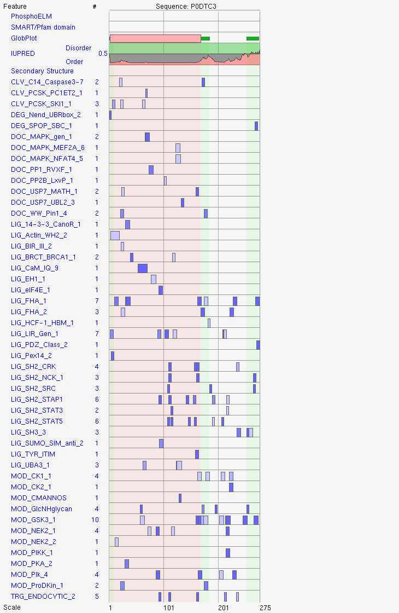

[COVID: the virus was never proven to exist](https://www.humanmine.org/humanmine/api.do)

# Introduction

[https://youtu.be/4605UcVYZ1s](https://youtu.be/4605UcVYZ1s)

[http://amigo.geneontology.org/amigo/term/GO:0005515](http://amigo.geneontology.org/amigo/term/GO:0005515)

23195	IPR002035	VWF_A           
23195	IPR036465	vWFA_dom_sf         

Many previously reported affinity capture results were supported with evidence from proximity label-ms experiments that identified proximal interactors [Stokalov 2020, Multi-level proteomics reveals host-perturbation strategies of SARS-CoV-2 and SARS-CoV](https://www.frontiersin.org/articles/10.3389/fmicb.2020.02101/full)

## ORF3a

1186	IPR001807	Cl-channel_volt-gated		                
1186	IPR002249	Cl_channel-7		                
1186	IPR014743	Cl-channel_core             

R-HSA-9694322, Virion Assembly and Release
R-HSA-9694614, Attachment and Entry
R-HSA-9694635, Translation of structural proteins
R-HSA-9694719, Maturation of protein 3a

[https://reactome.org/content/schema/instance/browser/R-HSA-9679509](https://reactome.org/content/schema/instance/browser/R-HSA-9679509)

[Insertion of tail-anchored proteins into the endoplasmic reticulum membrane (R-HSA-9609523)](https://reactome.org/content/schema/instance/browser/R-HSA-9679509)

"HMOX1" "CYB5A" "VAMP2" "BAG6"  "STX5"  "VAPA"  "GET4"  "UBL4A"

[Cell surface interactions at the vessicular wall (R-HSA-202733)](https://reactome.org/content/schema/instance/browser/R-HSA-202733)

 [1] "PROCR"     "ITGA6"     "TNFRSF10B" "CD99"      "TNFRSF10D" "PTPN11"    "TNFRSF10A" "CD44"     
 [9] "CXADR"     "SLC7A11"   "GLG1"      "SLC16A1"   "SRC"       "SLC16A3"   "JAM3"      "LYN"      
[17] "SLC3A2"    "YES1"      "ITGB1"     "MIF"       "PPIA"     

[ebi.ac.uk/interpro/entry/InterPro/IPR024407/](https://www.ebi.ac.uk/interpro/entry/InterPro/IPR024407/)

"Forms homotetrameric potassium sensitive ion channels (viroporin) and may modulate virus release. Up-regulates expression of fibrinogen subunits FGA, FGB and FGG in host lung epithelial cells. Induces apoptosis in cell culture. Downregulates the type 1 interferon receptor by inducing serine phosphorylation within the IFN alpha-receptor subunit 1 (IFNAR1) degradation motif and increasing IFNAR1 ubiquitination. 
The 3a protein is a pro-apoptosis-inducing protein. It localises to the endoplasmic reticulum (ER)-Golgi compartment. SARS-CoV causes apoptosis of infected cells through NLRP3 inflammasome activation, as ORF3a is a potent activator of the signals required for this activation, pro-IL-1beta gene transcription and protein maturation. This protein also promotes the ubiquitination of apoptosis-associated speck-like protein containing a caspase recruitment domain (ASC) mediated by its interaction with TNF receptor-associated factor 3 (TRAF3). The expression of ORF3a induces NF-kappa B activation and up-regulates fibrinogen secretion with the consequent high cytokine production [4, 5, 6, 7]. Another apoptosis mechanism described for this protein is the activation of the PERK pathway of unfolded protein response (UPR), which causes phosphorylation of eIF2alpha and leads to reduced translation of cellular proteins as well as the activation of pro-apoptotic downstream effectors (i.e ATF4, CHOP) [8]."

[SARS-CoV-2 and ORF3a: Nonsynonymous Mutations, Functional Domains, and Viral Pathogenesis](10.1128/mSystems.00266-20)

VG: [1489669(ORF3a) | 43740569(ORF3a) | 9714825(ORF3)](https://www.genome.jp/dbget-bin/www_bget?K24579)

### PTM sites

#### Glycosylation 

[https://glygen.org/protein/P0DTC3#glycosylation](https://glygen.org/protein/P0DTC3#glycosylation)

Exists in both O-glycosylated and non-glycosylated forms. The glycosylated form is associated with the virion. Predicted O-linked threonine sites are Thr32 and Thr34

### ELM motifs

#### P0DTC3

### Signal peptidase cleavage and exocytosis

[https://en.wikipedia.org/wiki/Signal_peptidase](https://en.wikipedia.org/wiki/Signal_peptidase)

#### SPCS2

    - Proximity Label-MS	@StGermain_2020
    
    - Proximity Label-MS	Samavarchi_2020

#### SPCS3	

    - Proximity Label-MS	@StGermain_2020

### GO annotations

#### GO CC for ORF3a hits

 ID                            Description                 Count GeneRatio            
 
 GO:0043226                                    organelle     985     985/961            
 GO:0016020                                     membrane     976     976/961            
 GO:0044422                         organelle part     784     784/961            
 GO:0044425                            membrane part     772     772/961            
 GO:0032991 protein-containing complex     464     464/961            
 GO:0005576             extracellular region     422     422/961            
 GO:0044421    extracellular region part     386     386/961            
 GO:0031974        membrane-enclosed lumen     279     279/961            
 GO:0030054                            cell junction     207     207/961            
 GO:0045202                                        synapse     171     171/961            
 GO:0044456                             synapse part     132     132/961            
 GO:0099080         supramolecular complex        52        52/961            

 
#### GO BPs ranked by p-value

 ID                        Description         GeneRatio    BgRatio            pvalue                 
 
 GO:0048193 Golgi vesicle transport    74/937    368/18670    3.362034e-25            
 GO:0016050        vesicle organization    67/937    325/18670    1.519181e-23            
 GO:0090150     membrane localization    65/937    332/18670    1.353006e-21            
 GO:1990778                    cell periphery    62/937    311/18670    4.512532e-21            
 GO:0034976     response to ER stress    60/937    285/18670    1.785291e-18            

#### Immunological GO BPs for ORF3a hits

 ID                        Description                 Count            
 
 GO:0061919             autophagic mechanism        82                
 GO:0001816                cytokine production        72                
 GO:0002253         activation immune resp.     52                
 GO:0050900                leukocyte migration        48                
 GO:0019882             antigen presentation        40                
 
#### SNAP25

        - Affinity Capture-MS @Stukalov_2020

#### SNAP23

        - Proximity Label-MS @Laurent_2020
        
### Sorting nexin family

Total 8 unique members represented

#### SNX1

        - Affinity Capture-MS @Stukalov_2020
        
        - Proximity Label-MS @Laurent_2020

#### SLC family

    - Various interactions/authors

https://en.wikipedia.org/wiki/Solute_carrier_family

### PDZ domain interactions

#### PDLIM1

    - Affinity Capture-MS	@Stukalov_2020

#### PDXDC1 

    - Proximity Label-MS	@Samavarchi_2020

#### PDZD11	

    - Proximity Label-MS	@Laurent_2020

## COVID-19 Disease

### Acute kidney injusry (AKI) and role of ORF3a

[https://www.ncbi.nlm.nih.gov/pmc/articles/PMC3558681/](https://www.ncbi.nlm.nih.gov/pmc/articles/PMC3558681/)

"RvD1, RvE1, or 14S,21R-diHDHA also switches Mfs to the phenotype that produces pro-resolving interleukin-10. RvDs also repress renal interstitial fibrosis, and PD1 promotes renoprotective heme-oxygenase-1 expression.These findings provide novel approaches for targeting inflammation resolution and LMs or modulation of LM-associated pathways for developing better clinical treatments for AKI."

https://www.genome.jp/kegg-bin/show_pathway?hsa05171+N01314

https://www.genome.jp/kegg-bin/show_network?nt06171

https://www.genome.jp/dbget-bin/www_bget?ne:N01314

[ebi.ac.uk/interpro/entry/InterPro/IPR024407/](https://www.ebi.ac.uk/interpro/entry/InterPro/IPR024407/)
[ouhsc.edu/platelets/DITMA.htm](https://www.ouhsc.edu/platelets/DITMA.htm)

## COVID-19-associated Coagulopathy

[Proposal of the Definition for COVID-19-Associated Coagulopathy](https://doi.org/10.3390/jcm10020191)

"[...] angiopoietin 2 is known to stimulate prothrombotic responses through tissue factor and phosphatidylserine exposure in sepsis. Thus, angiopoietin 2 is considered as the common factor in the pathogenesis of CAC and sepsis-associated DIC."

### Mechanisms of COVID-19-associated coagulopathy 

#### See the following: 

        - Figure 2 of [@Iba_2020] 
        
        - Figures 2 and 3 of [@stukalov_2020]

#### Inflammatory action of proteases in disease

https://www.ncbi.nlm.nih.gov/pmc/articles/PMC4387953/

"The blood circulating zymogens of these proteases enter damaged tissue as a consequence of vascular leak or rupture to become activated and contribute to extravascular coagulation or fibrinolysis. The coagulants, factor Xa (FXa), factor VIIa (FVIIa), tissue factor, and thrombin, also evoke cell-mediated actions on structural cells (e.g., fibroblasts and smooth muscle cells) or inflammatory cells (e.g., macrophages) via the proteolytic activation of protease-activated receptors (PARs). Plasmin, the principle enzymatic mediator of fibrinolysis, also forms toll-like receptor-4 (TLR-4) activating fibrin degradation products (FDPs) and can release latent-matrix bound growth factors such as transforming growth factor-β (TGF-β). Furthermore, the proteases that convert plasminogen into plasmin (e.g., urokinase plasminogen activator) evoke plasmin-independent proinflammatory actions involving coreceptor activation."

#### Endothelial control of coagulation

https://www.ncbi.nlm.nih.gov/pmc/articles/PMC4617895/

"In the blood coagulation cascade, thrombin generation is initiated by activation of the extrinsic pathway, triggered by activation of fVII to form fVIIa, or by activation of the intrinsic pathway, triggered by activation of fXII to form fXIIa. In the extrinsic pathway, activated endothelial cells express TF on the cell surface. TF is constitutively expressed in extravascular tissues, such as fibroblasts and smooth muscle cells [21] and the phenomenon has been described as a hemostatic envelope that limits bleeding after vascular injury [22]. Although TF is not typically expressed in the intravascular space, activated endothelial cells and adhered leukocytes may express active TF in response to vascular injury or inflammatory stimuli. For example, activated endothelial cells express TF, which has an important role in the pathogenesis of thrombosis [23, 24]. TF is also abundantly expressed in atherosclerotic plaques and is found in both cellular (macrophages, vascular smooth muscle cells, and endothelial cells) and acellular (foam cell-derived debris within the necrotic core) regions [25, 26]. Furthermore, under experimental conditions, cultured endothelial cells express TF in the presence of pro-inflammatory molecules, such as lipopolysaccharide, tumor necrosis factor-α (TNF-α), interleukin-1β (IL-1β), thromboxane A2, vascular endothelial growth factor, and thrombin [27–40]. In contrast, only a few studies have reported endothelial TF expression in animal models. How and why TF encryption occurs has been a matter of great debate [45], and is beyond the scope of this review. Several lines of evidence have suggested that the effects of endothelial cell-derived TF may not be confined to the coagulation network. The TF/fVIIa complex activates protease activated receptor (PAR)-2 [24], which induces a pro-inflammatory response. TF deficiency has been associated with decreased IL-6 expression via fXa-dependent activation of PAR-2 in a murine model of sickle cell disease [46]. Furthermore, microvascular endothelial cells have been observed to induce angiogenesis and collateral vessel formation through the release of TF-rich microparticles [47]. The collective data suggest that TF has a multitude of hematologic and vascular effects although further work is required to elucidate the origin and role of endothelial cell-derived TF"

### Gene set: Hemostasis (R-HSA-109582)

 [1] "PROCR"     "CLU"       "ATP2B4"    "GNA13"     "ITGA6"     "FAM49B"    "TNFRSF10B" "LRP8"          
 [9] "CD99"      "STX4"      "VPS45"     "RAB5A"     "TNFRSF10D" "PTPN11"    "ANXA5"     "STXBP3"          
[17] "TNFRSF10A" "CD44"      "CALU"      "ATP2A2"    "ABCC4"     "CXADR"     "ALDOA"     "SLC7A11"        
[25] "GLG1"      "ATP2B1"    "TEX264"    "TOR4A"     "PTPN1"     "RAC1"      "SLC16A1"   "SRC"              
[33] "DGKE"      "SLC16A3"   "WDR1"      "CDC42"     "EHD1"      "JAM3"      "KIF16B"    "LYN"      
[41] "PCDH7"     "RBSN"      "SLC3A2"    "YES1"      "ITGB1"     "MAPK1"     "MIF"       "PPIA"           
[49] "RAP1A"  

### WD40 mYVTN repeat/repeat motif

55823	IPR015943	WD40/YVTN_repeat-like_dom_sf		
55823	IPR036322	WD40_repeat_dom_sf		

### Reactome - Fibrin clot formation

[https://reactome.org/content/detail/R-HSA-140875](https://reactome.org/content/detail/R-HSA-140875)

51378	IPR002181	Fibrinogen_a/b/g_C_dom		
51378	IPR014715	Fibrinogen_a/b/g_C_2
51378	IPR014716	Fibrinogen_a/b/g_C_1		
51378	IPR020837	Fibrinogen_CS		
51378	IPR036056	Fibrinogen-like_C

### KEGG complement-mediated coagulation

[https://www.genome.jp/kegg-bin/show_pathway?hsa04610+712](https://www.genome.jp/kegg-bin/show_pathway?hsa04610+712)

#### Neutrophil extracellular traps (NETs)

https://en.wikipedia.org/wiki/Neutrophil_extracellular_traps

"Suicidal NETosis was first described in a 2007 study that noted that the release of NETs resulted in neutrophil death through a different pathway than apoptosis or necrosis.[11] In suicidal NETosis, the intracellular NET formation is followed by the rupture of the plasma membrane, releasing it into the extracellular space. This NETosis pathway can be initiated through activation of Toll-like receptors (TLRs), Fc receptors, and complement receptors with various ligands such as antibodies, PMA, and so on.[10][12] The current understanding is that upon activation of these receptors, downstream signaling results in the release of calcium from the endoplasmic reticulum. This intracellular influx of calcium in turn activates NADPH oxidase, resulting in activation of the NETosis pathway as described above.[12] Of note, suicidal NETosis can take hours, even with high levels of PMA stimulation, while vital NETosis that can be completed in a matter of minutes.[10] Neutrophil extracellular traps (NETs) are networks of extracellular fibers, primarily composed of DNA from neutrophils, which bind pathogens.[2] NET activation and release, or NETosis, is a dynamic process that can come in two forms, suicidal and vital NETosis. Overall, many of the key components of the process are similar for both types of NETosis, however, there are key differences in stimuli, timing, and ultimate end result.[10] The process is thought to begin with NADPH oxidase activation of protein-arginine deiminase 4 (PAD4) via reactive-oxygen species (ROS) intermediaries. PAD4 is responsible for the citrullination of histones in the neutrophil, resulting in decondensation of chromatin. Azurophilic granule proteins such as myeloperoxidase (MPO) and neutrophil elastase (NE) then enter the nucleus and further the decondensation process, resulting in the rupture of the nuclear envelope."

6046	IPR027353	NET_dom

#### Defective clearance of complement

https://www.genome.jp/kegg-bin/show_pathway?hsa05322

#### Complement C1q subcomponent subunit A

https://www.genome.jp/dbget-bin/www_bget?hsa:712+hsa:713+hsa:714

"hsa04610    	Complement and coagulation cascades; hsa05020    	Prion disease; hsa05133    	Pertussis; hsa05142    	Chagas disease; hsa05150    	Staphylococcus aureus infection; hsa05171    	Coronavirus disease - COVID-19; hsa05322    	Systemic lupus erythematosus"
                                                           
# Structural domain annotations

https://en.wikipedia.org/wiki/EEA1

"EEA1 is a RAB5A effector protein which binds via an N-terminal zinc finger domain and is required for fusion of early and late endosomes and for sorting at the early endosome level.[5][6] Due to the proteins importance in vesicular trafficking, a number of intracellular bacteria prevent EEA1 recruitment to the vacuole. Mycobacterium tuberculosis is known to inhibit the recruitment of EEA1 to the phagosomal membrane through CamKII.[7] Legionella pneumophila also prevents EEA1 recruitment through a currently unknown mechanism.[8] The related pathogen Legionella longbeachae recruits EEA1 and appears to replicate within a modified early endosome.[9]"

# Results (ORF3a Sequence Motifs)

## ELM Eukaryotic Linear Motifs 

[http://elm.eu.org/start_search/P0DTC7.tsv](http://elm.eu.org/start_search/P0DTC7.tsv)

[http://elm.eu.org/start_search/P0DTC8.tsv](http://elm.eu.org/start_search/P0DTC8.tsv)

[http://elm.eu.org/start_search/P0DTC3.tsv](http://elm.eu.org/start_search/P0DTC8.tsv)

    - [MOD_CMANNOS](http://elm.eu.org/elms/MOD_CMANNOS.html)
    
https://elifesciences.org/articles/52978

"C-mannosylation supports folding and enhances stability of thrombospondin repeats: Previous studies demonstrated importance of C-mannosylation for efficient protein secretion. To study its impact on protein folding and stability, we analyzed both C-mannosylated and non-C-mannosylated thrombospondin type 1 repeats (TSRs) of netrin receptor UNC-5. In absence of C-mannosylation, UNC-5 TSRs could only be obtained at low temperature and a significant proportion displayed incorrect intermolecular disulfide bridging, which was hardly observed when C-mannosylated. Glycosylated TSRs exhibited higher resistance to thermal and reductive denaturation processes, and the presence of C-mannoses promoted the oxidative folding of a reduced and denatured TSR in vitro. Molecular dynamics simulations supported the experimental studies and showed that C-mannoses can be involved in intramolecular hydrogen bonding and limit the flexibility of the TSR tryptophan-arginine ladder. We propose that in the endoplasmic reticulum folding process, C-mannoses orient the underlying tryptophan residues and facilitate the formation of the tryptophan-arginine ladder, thereby influencing the positioning of cysteines and disulfide bridging."

## Integrin RGD motif binding

https://www.mdpi.com/1999-4915/13/2/146

"This paper considers the hypothesis that viral binding to cell-surface integrins may contribute to the high infectivity and widespread extra-pulmonary impacts of the SARS-CoV-2 virus. This potential is suggested on the basis of the emergence of an RGD (arginine-glycine-aspartate) sequence in the receptor-binding domain of the spike protein. RGD is a motif commonly used by viruses to bind cell-surface integrins. The highly infectious variant, B.1.1.7 (or VUI 202012/01), includes a receptor-binding domain amino acid replacement, N501Y, that could potentially provide the RGD motif with enhanced access to cell-surface integrins, with consequent clinical impacts."

## Integrin beta 1 binding

Reactome [RP11-479G22.2](https://reactome.org/content/query?q=RP11-479G22.2+integrin+beta-1-binding+1&species=Homo+sapiens&species=Entries+without+species&cluster=true)

### Integrin alpha 6 (ITGA6/VLA-6)

    - Affinity Capture-MS     @Stukalov_2020

#### Fibronectin receptor integrin beta 1 (ITGB1/FNRB/GPIIa/VLAB) 

    - Proximity Label-MS    @StGermain_2020

## Kallikrein-kinin systems

## TRAIL-R2

https://en.wikipedia.org/wiki/TNF_receptor_superfamily

Tumor necrosis factor receptor superfamily, member 10b (TRAIL-R2)

    - Affinity Capture-MS                @Stukalov_2020
    
    - Proximity Label-MS                @Laurent_2020
    
[Clathrin mediated endocytosis (R-HSA-8856828)](https://reactome.org/PathwayBrowser/#/R-HSA-8856828)

 [1] "TGOLN2"  "LDLR"    "UBQLN1"  "VAMP3"   "STAM2"   "TOR1A"   "IGF2R"   "RAB5A"   "TOR1B"   "VAMP7"  
[11] "VAMP2"   "ARPC1A"  "AP2M1"   "CLTC"    "EPN2"    "RAB5C"   "RPS27A"  "TFRC"    "HGS"     "EGFR"   
[21] "FCHO2"   "LDLRAP1" "LRP2"    "PICALM"  "UBQLN2" 

https://reactome.org/PathwayBrowser/#/R-HSA-75158

 ID                 Pathway             Fold Enrich    Raw p-value    FDR 

 R-HSA-75158     TRAIL signalling     +10.74     1.45E-03     2.41E-02 

"Tumor necrosis factor-related apoptosis-inducing ligand or Apo 2 ligand (TRAIL/Apo2L) is a member of the tumor necrosis factor (TNF) family. This group of apoptosis induction pathways all work through protein interactions mediated by the intracellular death domain (DD), encoded within the cytoplasmic domain of the receptor. TRAIL selectively induces apoptosis through its interaction with the Fas-associated death domain protein (FADD) and caspase-8/10 (Wang S & el-Deiry WS 2003; Sprick MR et al. 2002)."

"TRAIL and its receptors, TRAIL-R1 and TRAIL-R2, were shown to be rapidly endocytosed via clathrin-dependent and -independent manner in human Burkitt's lymphoma B cells (BJAB) (Kohlhaas SL et al. 2007). However, FADD and caspase-8 were able to bind TRAIL-R1/R2 in TRAIL-stimulated BJAB cells at 4oC (at which membrane trafficking is inhibited), suggesting that the endocytosis was not required for an assembly of the functional TRAIL DISC complex. Moreover, blocking of clathrin-dependent endocytosis did not interfere with the capacity of TRAIL to promote apoptosis (Kohlhaas SL et al. 2007)."

https://www.ncbi.nlm.nih.gov/pmc/articles/PMC1170170/

"TRAIL is a member of the tumor necrosis factor (TNF) family of cytokines and induces apoptosis in a wide variety of cells. Based on homology searching of a private database, a receptor for TRAIL (DR4 or TRAIL-R1) was recently identified. Here we report the identification of a distinct receptor for TRAIL, TRAIL-R2, by ligand-based affinity purification and subsequent molecular cloning. TRAIL-R2 was purified independently as the only receptor for TRAIL detectable on the surface of two different human cell lines that undergo apoptosis upon stimulation with TRAIL. TRAIL-R2 contains two extracellular cysteine-rich repeats, typical for TNF receptor (TNFR) family members, and a cytoplasmic death domain. TRAIL binds to recombinant cell-surface-expressed TRAIL-R2, and TRAIL-induced apoptosis is inhibited by a TRAIL-R2-Fc fusion protein. TRAIL-R2 mRNA is widely expressed and the gene encoding TRAIL-R2 is located on human chromosome 8p22-21. Like TRAIL-R1, TRAIL-R2 engages a caspase-dependent apoptotic pathway but, in contrast to TRAIL-R1, TRAIL-R2 mediates apoptosis via the intracellular adaptor molecule FADD/MORT1. The existence of two distinct receptors for the same ligand suggests an unexpected complexity to TRAIL biology, reminiscent of dual receptors for TNF, the canonical member of this family."

https://doi.org/10.1161/CIRCRESAHA.109.196840

"The authors found that thrombin induced the expression of both cell associated and soluble forms of TRAIL/Apo2L, a member of the TNFα superfamily. Soluble TRAIL (sTRAIL) was found to play a role in MP release because knockdown of TRAIL expression reduced the ability of supernatants from thrombin-stimulated cells to generate MPs. Moreover, exogenous sTRAIL induced MP release from cells. TRAIL binds to a number of different receptors, including DR4 (TRAIL-R1) and DR5 (TRAIL-R2). Both receptors were expressed by the endothelial cells, but only TRAIL-R2 was induced by thrombin. Knockdown of TRAIL-R2 reduced thrombin induction of MPs indicating that it participated in the pathway of MP formation."

### Death receptor signalling

[FADD](https://en.wikipedia.org/wiki/FADD)

[TRAIL/Apo2L](https://reactome.org/PathwayBrowser/#/R-HSA-75158)                        

https://en.wikipedia.org/wiki/Death_receptor_5

"Death receptor 5 (DR5), also known as TRAIL receptor 2 (TRAILR2) and tumor necrosis factor receptor superfamily member 10B (TNFRSF10B), is a cell surface receptor of the TNF-receptor superfamily that binds TRAIL and mediates apoptosis."

8737	IPR000488	Death_domain		
8737	IPR011029	DEATH-like_dom_sf		
8737	IPR025735	RHIM_dom		
8737	IPR037934	RIP1_Death      

## TP53 Regulates Transcription of Cell Death Genes (R-HSA-5633008)

TNFRSF10B/STEAP3/TNFRSF10D/TNFRSF10A/NDRG1

#### TNIP1

    - Affinity Capture-MS @Stukalov_2020

#### TNFSF9

    - Affinity Capture-MS @Stukalov_2020

#### TNFRSF21

    - Affinity Capture-MS @Stukalov_2020

#### TNFRSF1A

    - Affinity Capture-MS @Stukalov_2020

#### TNFRSF10D

    - Affinity Capture-MS @Stukalov_2020

#### TNFRSF10B

    - Affinity Capture-MS @Stukalov_2020
    
    - Proximity Label-MS @Laurent_2020

#### TNFRSF10A

    - Affinity Capture-MS @Stukalov_2020

#### LTBR

    - Affinity Capture-MS @Stuaklov_2020

### Neuropilin 

https://www.ncbi.nlm.nih.gov/pmc/articles/PMC4726805/

"BCC prevent motor neuron exit through multiple mechanisms. (A) BCC express SEMA6A, which signals through PLXNA2/NRP2 receptors on motor neurons (MN; Bron et al., 2007; Mauti et al., 2007). NTN5 from BCC prevent ectopic MN migration through putative interactions with DCC, probably in concert with an UNC5 receptor. In the absence of NTN5 (B) a subset of MNs exit the CNS. This is a separate subset from that depending on semaphorin signaling for proper positioning. When BCC are completely ablated (C), more MNs enter the ventral root than in Ntn5 or Sema/Plxn/Nrp mutants alone (Vermeren et al., 2003)."

https://hagrid.dbmi.pitt.edu/wiki-pi/index.php/search?q=NRP2

"Search results for NRP2"

https://hagrid.dbmi.pitt.edu/wiki-pi/index.php/pair/view/8829/10371

"NRP1 and SEMA3A - [...] the paper that reports this interaction (PMID 10520994)"

#### NRP2

    - Affinity Capture                @Stukalov_2020

#### NETO2

    - @Stukalov_2020        
    - @Samavarchi_2020      

### Semaphorin

#### SEMA4C

- Affinity Capture-MS                @Stukalov_2020

- Proximity Label-MS                @Samavarchi_2020

#### SEMA4B

- Affinity Capture-MS                @Stukalov_2020

#### SEMA6A

- Proximity Label-MS                @Laurent_2020

### Discoidin domain

https://en.wikipedia.org/wiki/Discoidin_domain

    - https://en.wikipedia.org/wiki/DDR1            
    - https://en.wikipedia.org/wiki/DLG1            
    - https://en.wikipedia.org/wiki/DCBLD2            

### Apolipoprotein e receptor (APOER2)

Wiki: [ApoER2](https://en.wikipedia.org/wiki/Low-density_lipoprotein_receptor-related_protein_8)

#### Antiphospholipid syndrome 

ApoER2 is thought to play a key role in the process of platelet binding. Antiphospholipid syndrome is an autoimmune disease characterized by thrombosis and complications during pregnancy, often leading to fetal death. It is caused by the presence of antibodies against anionic phospholipids and β2-glycoprotein I (β2GPI). The anti-β2GPI antibodies are most prevalent in causing the symptoms of the disease. When bound by an antibody, β2GPI begins to interact with monocytes, endothelial cells, and platelets. ApoER2 is thought to play a key role in the process of platelet binding. β2GPI has the proper binding site for interaction with ApoER2 and other LDL family receptors, and it is speculated that the antibody/β2GPI complexes interact with ApoER2 on platelets. This causes the phosphorylation of a p38MAPkinase, resulting in the production of thromboxane A2. Thromboxane A2 functions to activate more platelets, and this leads to a greater chance for blood clots to form. There is also speculation that the antibody/β2GPI complexes sensitize other cell types through various LDL family receptors to lead to less common symptoms other than thrombosis.[19]

"ApoER2 is a protein made up of 870 amino acids. It is separated into a ligand binding domain of eight ligand binding regions, an EGF-like domain containing three cysteine-rich repeats, an O-linked glycosylation domain of 89 amino acids, a transmembrane domain of 24 amino acids, and a cytoplasmic domain of 115 amino acids, including an NPXY motif.[9]

A diagram of the structure of APOER2            
Structure for APOER2 (extracellular to intracellular): a ligand binding repeat, EGF repeat, YWTD-β propeller, O-linked sugar domain, transmembrane domain, and a cytoplasmic tail containing an NPxY motif.
Each letter in the NPXY motif represents a certain amino acid where N is arginine, P is proline, X is any amino acid, and Y is tyrosine.

Cytoplasmic tail            
All LDL receptor family proteins contain a cytoplasmic tail with at least one NPXY motif. This motif is important for binding intracellular adapter proteins and endocytosis. ApoER2 is distinct from most other members of the LDL family of receptors due to a unique insert on its cytoplasmic tail. In ApoER2, there is a proline-rich 59 amino acid insert encoded by the alternatively spliced exon 19. This insert allows for protein interactions that are unable to occur with other LDL receptors. It binds the PSD-95 adapter protein, cross-linking ApoER2 and the NMDA receptors during the process of long-term potentiation, and is also bound specifically by JIP-2, an important interaction in the JNK signalling pathway. It is also speculated that this insert may diminish the function of ApoER2 in lipoprotein endocytosis by somehow disrupting the NPXY motif.[8][9]"

#### Low density lipoprotein receptor-related protein 8 (LRP-8) (APOER2)

- Affinity Capture-MS                @Stukalov             
- Proximity Label-MS                @Samavarchi_2020             

## PfEMP1

https://www.ncbi.nlm.nih.gov/pmc/articles/PMC5052687/

"Here we describe the structure of CD36 in complex with long chain fatty acids and a CD36-binding PfEMP1 protein domain. A conserved hydrophobic pocket allows the hugely diverse PfEMP1 protein family to bind to a conserved phenylalanine residue at the membrane distal tip of CD36. This phenylalanine is also required for CD36 to interact with lipoprotein particles. By targeting a site on CD36 that is required for its physiological function, PfEMP1 proteins maintain the ability to tether to the endothelium and avoid splenic clearance."

https://pubmed.ncbi.nlm.nih.gov/26491221/

"The leukocyte/endothelium interaction and neutrophil accumulation are also observed in the lungs.However, lung interactions differ from brain interactions, likely due to differences in the blood-brain barrier and blood-air barrier tight junction composition of the brain and lung endothelium.Furthermore, we hypothesize a possible use of adjunctive therapies to antimalarial drugs that target the interaction between the leukocytes and the endothelium."

## Endothelial protein-C receptor (PROCR)

https://www.ncbi.nlm.nih.gov/pmc/articles/PMC4617895/

"Endothelial cell control of thrombosis"

https://www.ebi.ac.uk/interpro/entry/InterPro/IPR015669/

"EPCR is an MHC classes I/II-like antigen recognition protein Upon vascular injury, flowing blood is exposed to cells expressing tissue factor (TF) on their surfaces and FVII/FVIIa binds to its receptor/cofactor TF and is rapidly activated to FVIIa and the activity of bound FVIIa is dramatically enhanced. The TF/FVIIa complex activates zymogens factor X (FX) and factor IX (FIX). The FXa, in the absence of activated cofactor factor Va (FVa) generates only trace amounts of thrombin. Although insufficient to initiate fibrin polymerisation alone, these small amounts of thrombin, however, back activate factors V (FV), VIII (FVIII), and XI (FXI). FVIII and FV function as membrane-bound cofactors for proteinases FIXa and FXa, respectively increasing the Vmax of the reaction complexes dramatically. Amplification of the pro-coagulant response consequently occurs through formation of the tenase complex FIXa/FVIIIa and the thrombinase complex FXa/FVa that generate sufficient amounts of thrombin to mediate sustained haemostasis."

https://reactome.org/content/detail/R-HSA-5607004

https://pubmed.ncbi.nlm.nih.gov/11035113/

"The protein C pathway is a primary regulator of blood coagulation and a critical component of the host response to inflammatory stimuli. The most recent member of this pathway is the endothelial protein C receptor (EPCR), a type I transmembrane protein with homology to CD1d/MHC class I proteins. EPCR accelerates formation of activated protein C, a potent anticoagulant and antiinflammatory agent. The current study demonstrates that soluble EPCR binds to PMA-activated neutrophils. Using affinity chromatography, binding studies with purified components, and/or blockade with specific Abs, it was found that soluble EPCR binds to proteinase-3 (PR3), a neutrophil granule proteinase. Furthermore, soluble EPCR binding to neutrophils was partially dependent on Mac-1 (CD11b/CD18), a beta(2) integrin involved in neutrophil signaling, and cell-cell adhesion events. PR3 is involved in multiple diverse processes, including hemopoietic proliferation, antibacterial activity, and autoimmune-mediated vasculitis. The observation that soluble EPCR binds to activated neutrophils via PR3 and a beta(2) integrin suggests that there may be a link between the protein C anticoagulant pathway and neutrophil functions."

https://www.ncbi.nlm.nih.gov/pmc/articles/PMC4297295/

"Structural Conservation Despite Huge Sequence Diversity Allows EPCR Binding by the PfEMP1 Family Implicated in Severe Childhood Malaria"

 

https://www.ncbi.nlm.nih.gov/pmc/articles/PMC538274/

"Despite the presence of tissue factor - factor VII complex it is unlikely that all fibrin in the atherosclerotic plaque is the direct result from local clotting activity.Inflammation overwhelms protective anticoagulant forces, which in itself may have become less efficient due to down regulation of thrombomodulin and endothelial cell protein C receptor (EPCR) expression.In this phase, the inflammatory drive leads to recurrent induction of tissue factor and assembly of catalytic complexes on aggregated cells and on microparticles, maintaining a certain level of thrombin production and fibrin formation."

https://www.ncbi.nlm.nih.gov/pmc/articles/PMC4387953/

"The coagulants, factor Xa (FXa), factor VIIa (FVIIa), tissue factor, and thrombin, also evoke cell-mediated actions on structural cells (e.g., fibroblasts and smooth muscle cells) or inflammatory cells (e.g., macrophages) via the proteolytic activation of protease-activated receptors (PARs). Plasmin, the principle enzymatic mediator of fibrinolysis, also forms toll-like receptor-4 (TLR-4) activating fibrin degradation products (FDPs) and can release latent-matrix bound growth factors such as transforming growth factor-β (TGF-β). Furthermore, the proteases that convert plasminogen into plasmin (e.g., urokinase plasminogen activator) evoke plasmin-independent proinflammatory actions involving coreceptor activation. Selectively targeting the receptor-mediated actions of hemostatic proteases is a strategy that may be used to treat inflammatory disease without the bleeding complications of conventional anticoagulant therapies. The mechanisms by which proteases of the coagulant and fibrinolytic systems contribute to extravascular inflammation in disease will be considered in this review."

https://www.ncbi.nlm.nih.gov/pmc/articles/PMC2998441/

"The evolutionary tree reveals that YF1 isoforms are closely related to chicken MHC-BF2 variants and classical mammalian as well as non-mammalian (frog, nurse shark) class I heavy chains (red box) but are also similar to mammalian MR1 chains and human ZAG. YF1 heavy chains are, however, only distantly related to chicken and mammalian CD1 molecules as well as to EPCR."

### HLA 

#### HLA-A

    - Proximity Label-MS	@StGermain_2020             
    - Affinity Capture-MS	@Stukalov_2020              
    - Proximity Label-MS	@Samavarchi_2020                

#### HLA-C

    - Affinity Capture-MS	@Stukalov_2020              
    
#### HLA-E	

    - Affinity Capture-MS	@Stukalov_2020              
    
#### HLA-G

    - Affinity Capture-MS	@Stukalov_2020              
    - Affinity Capture-MS   @Stukalov_2020              

#### HM13

    - Proximity Label-MS	@Samavarchi_2020            

#### MR1

https://www.ncbi.nlm.nih.gov/gene/3140          

"MAIT (mucosal-associated invariant T-cells) lymphocytes represent a small population of T-cells primarily found in the gut. The protein encoded by this gene is an antigen-presenting molecule that presents metabolites of microbial vitamin B to MAITs. This presentation may activate the MAITs to regulate the amounts of specific types of bacteria in the gut. Several transcript variants encoding different isoforms have been found for this gene, and a pseudogene of it has been detected about 36 kbp upstream on the same chromosome. [provided by RefSeq, Jul 2015]"

### EPCR(10544)

- Affinity Capture-MS                @Stukalov_2020

https://www.uniprot.org/uniprot/Q9UNN8

"Binds activated protein C. Enhances protein C activation by the thrombin-thrombomodulin complex; plays a role in the protein C pathway controlling blood coagulation."

https://www.pnas.org/content/103/4/879

"Protein C is a multidomain vitamin K-dependent plasma serine protease zymogen that, upon activation by thrombin in complex with thrombomodulin (TM), down-regulates the coagulation cascade by inactivating factors Va and VIIIa by limited proteolysis (1–3)."

https://pubmed.ncbi.nlm.nih.gov/30384036/

"halassemia is characterized by a hypercoagulable state in which the protein C (PC) pathway controls thrombosis. We investigated changes in PC, protein S (PS), antithrombin III (AT III) and soluble endothelial protein C receptor (sEPCR) in thalassemia. [...] Conclusions: Deficiencies of anticoagulant proteins and elevated sEPCR contributed to chronic hypercoagulability in these thalassemia patients of Chinese origin. Splenectomy alleviated these alterations in this patient cohort with the median duration since splenectomy of two years. Blood transfusion was not ideal for avoiding thrombosis."

https://pubmed.ncbi.nlm.nih.gov/30383853/

"Genetics of the thrombomodulin-endothelial cell protein C receptor system and the risk of early-onset ischemic stroke"

https://pubmed.ncbi.nlm.nih.gov/30365003/

"Acquisition of Antibodies Against Endothelial Protein C Receptor-Binding Domains of Plasmodium falciparum Erythrocyte Membrane Protein 1 in Children with Severe Malaria"

## Protease-activated receptor (PAR-1)

#### MAP/microtubule affinity-regulating kinase 1 (MARK1) (PAR-1c)             

    - Proximity Label-MS                @Laurent_2020            
    
#### MAP/microtubule affinity-regulating kinase 2 (MARK2) (PAR-1b)             

    - Proximity Label-MS                @Laurent_2020            
    
#### MAP/microtubule affinity-regulating kinase 3 (MARK3) (PAR-1a)             

    - Proximity Label-MS                @Laurent_2020            
    
#### Calpain (CAPN2)             

    - Proximity Label-MS                @StGermain_2020            
    
https://pubmed.ncbi.nlm.nih.gov/33258989/

"[...] platelet-derived calpain1 (CAPN1) cleaves the protease-activated receptor 1 (PAR-1) on the surface of endothelial cells, which then initiates a signaling cascade that includes the activation of the tumor necrosis factor (TNF)-α converting enzyme (TACE). The latter elicits the shedding of the endothelial protein C receptor and the generation of TNF-α, which in turn, induces intracellular adhesion molecule (ICAM)-1 expression to promote monocyte adhesion. All of the effects of CAPN1 were mimicked by platelet-derived microparticles from diabetic patients or from wild-type mice but not from CAPN1-/- mice, and were not observed in PAR-1-deficient endothelial cells. Importantly, aortae from diabetic mice expressed less PAR-1 but more ICAM-1 than non-diabetic mice, effects that were prevented by treating diabetic mice with a calpain inhibitor as well as by the platelet specific deletion of CAPN1. Thus, platelet-derived CAPN1 contributes to the initiation of the sterile vascular inflammation associated with diabetes via the cleavage of PAR-1 and the release of TNF-α from the endothelial cell surface."

## MAPK

#### P0DTC3 ELMs

[P0DTC3 ELMS](http://elm.eu.org/start_search/P0DTC3.tsv)

    - 46	ELME000233	DOC_MAPK_gen_1	    MAPK docking motifs	            
    - 50	ELME000432	DOC_MAPK_MEF2A_6	MAPK docking motifs	            
    - 51	ELME000423	DOC_MAPK_NFAT4_5	MAPK docking motifs             

## Interferon

[https://www.nature.com/articles/s41598-021-81451-w](https://www.nature.com/articles/s41598-021-81451-w)

"The viral Orf3a protein from SARS-CoV can bind TRAF3 and activate the NLRP3 inflammasome65, leading to the cytokine storm. Given the higher basal inflammation in DS we would have expected the inflammasome to be upregulated. Instead, we detected a strong downregulation of the NLRP3 gene39, critical for maintenance of homeostasis against pathogenic infections66, along with lower levels of the gene for the NF- kB subunit RELA. Actually, even if the IFN-I signaling in the beginning induces an antiviral response, it eventually exerts an anti-inflammatory action inhibiting the NLRP3 inflammasome through STAT1. Although this could potentially be beneficial in later stage to shut inflammation down, it could also be one of the reasons why DS patients with influenza often manifest bacterial infection complications67.

A recent paper shows that SARS-CoV-2 receptor ACE2 is an interferon-stimulated gene in human airway epithelial cells and is detected in specific cell subsets across tissues55. Therefore, we predict that virus entry might be significantly increased in DS patients that have both an increased interferon signaling and triplication of the protein S-priming through TMPRSS2.

Tightly connected to this pathway, the MAPK signaling acts as an integration point of several biological processes56. In this pathway we found 7 genes downregulated (BCL231,33,39,57, FOS32,42,49,57,58,59, IFITM239,57,59, MAPK339,42,59, MAPK1032,57, MAPK1333,49,60, MAPK1432,33) and 5 upregulated (MAPK145,61, MAPK1113,62, IFITM132,41,45,52, IFI2732,39,51,52,63 and BST213,32,41,49,51,57). Interestingly, some of these proteins, such as Interferon Induced Transmembrane protein 1 (IFITM1), Interferon Induced protein 27 (IFI27) and Bone marrow stromal antigen 2 precursor (BST2), are all interferon-induced proteins with antiviral properties. Specifically, IFITM1 is active against multiple viruses, including SARS-CoV64, preventing the viral fusion after endocytosis and the release of viral contents into the cytosol."

3588	IPR015373	Interferon/interleukin_rcp_dom

### IFITM1	

    - Affinity Capture-MS	@Stukalov_2020

### IFNGR1  

    - Affinity Capture-MS	@Stukalov_2020

## ADAM metallopeptidase domain 17 (ADAM17)     

ADAM metallopeptidase domain 17 (ADAM17)            
    - Affinity Capture-MS                @Stukalov_2020            
    - Proximity Label-MS                @Samavarchi_2020             

https://pubmed.ncbi.nlm.nih.gov/32769398/

"Emerging data suggest severe lung injury in COVID-19 is associated with higher levels of TNF-α and IL-6, T-cell lymphopenia and exhaustion, hypercoagulability, and a macrophage-predominant immune response. This clinical picture is consistent with dysregulation of many of the molecular pathways in which ADAM17 participates."

https://pubmed.ncbi.nlm.nih.gov/27773542/
"HIV Nef- and Notch1-dependent Endocytosis of ADAM17 Induces Vesicular TNF Secretion in Chronic HIV Infection"

## TGF-beta receptor

[https://hagrid.dbmi.pitt.edu/wiki-pi/index.php/pair/view/8829/10371](https://hagrid.dbmi.pitt.edu/wiki-pi/index.php/pair/view/8829/10371)

[https://reactome.org/PathwayBrowser/#/ANALYSIS=MjAyMTAxMDQyMjE5MjBfMTQ0MTM%3D](https://reactome.org/PathwayBrowser/#/ANALYSIS=MjAyMTAxMDQyMjE5MjBfMTQ0MTM%3D)

[https://pubmed.ncbi.nlm.nih.gov/8630262/](https://pubmed.ncbi.nlm.nih.gov/8630262/)

[https://www.discoverx.com/targets/signaling-pathways/signaling-pathway-landing-pages/tgfbr-pathway](https://www.discoverx.com/targets/signaling-pathways/signaling-pathway-landing-pages/tgfbr-pathway)

"TGFB a small secreted polypeptide signals through the type II serine/threonine kinase dimeric receptor (TGFBR2) that recruits and phosphorylates the type I dimeric receptor (TGFBR1). TGFBR1 phosphorylates and activates SMADs which are transcription factors regulating genes involved in cell proliferation, differentiation, apoptosis and growth. Many advanced stage cancers are known to over-express both the TGFB and TGFBR promoting aggressive tumor formation. Inhibiting the TGFB signaling pathway is a key therapeutic strategy in treating cancer."

[Multi-level proteomics reveals host-perturbation strategies of SARS-CoV-2 and SARS-CoV](https://www.biorxiv.org/content/10.1101/2020.06.17.156455v1.full.pdf) @Stukalov_2020

"Alternatively, we found that ORF8 of SARS-CoV-2, but not its SARS-CoV homolog, binds specifically to the TGFB1-LTBP1 complex (Extended data Fig. 1f, h)."

[https://www.biorxiv.org/content/10.1101/2020.11.03.366666v1.abstract](https://www.biorxiv.org/content/10.1101/2020.11.03.366666v1.abstract)

"Binding of ORF3a and ORF8 to TGF-β-associated factors (TGFB1, TGFB2, LTBP1, TGFBR2, FURIN, BAMBI) supports a strong involvement to begging pro-inflammation state, while the direct interactions between ORF8 and components of Coagulation pathway, such as FGB, FGA, C5, PLAU, PROS1, SERPINE1, PLAT and CLU (17, 18) suggest a modulation of coagulation cascade by SARS-CoV-2. Although the biological function of the ORF8 protein of SARS-CoV-2 remains unclear, the role of ORF8 in severe COVID-19 outcome might be supported by SARS-CoV-2 variant with a 382-nucleotide deletion (Δ382) found in Singapore in January-February 2020 linked to mild forms of COVID-19. This deletion truncates open reading frame 7b and locks ORF8 transcription and would be associated to less cytokine releasing during the acute phase of infection (37, 38)."

[https://www.ncbi.nlm.nih.gov/pmc/articles/PMC4387953/](https://www.ncbi.nlm.nih.gov/pmc/articles/PMC4387953/)

"The coagulants, factor Xa (FXa), factor VIIa (FVIIa), tissue factor, and thrombin, also evoke cell-mediated actions on structural cells (e.g., fibroblasts and smooth muscle cells) or inflammatory cells (e.g., macrophages) via the proteolytic activation of protease-activated receptors (PARs). Plasmin, the principle enzymatic mediator of fibrinolysis, also forms toll-like receptor-4 (TLR-4) activating fibrin degradation products (FDPs) and can release latent-matrix bound growth factors such as transforming growth factor-β (TGF-β). Furthermore, the proteases that convert plasminogen into plasmin (e.g., urokinase plasminogen activator) evoke plasmin-independent proinflammatory actions involving coreceptor activation. Selectively targeting the receptor-mediated actions of hemostatic proteases is a strategy that may be used to treat inflammatory disease without the bleeding complications of conventional anticoagulant therapies. The mechanisms by which proteases of the coagulant and fibrinolytic systems contribute to extravascular inflammation in disease will be considered in this review."

#### FGFR1

    - Affinity Capture-MS @Stukalov_2020

#### CNPY2

    - Proximity Label-MS @Stukalov_2020

#### Signalling by TGF-beta receptor

MPR1A/PMEPA1/ACVR1B/BMPR2/FURIN/TGFBR2/TGFBR1/BMPR1B/STUB1/BAMBI/FKBP1A/XPO1/RPS27A/ZFYVE9/UCHL5

#### Signalling by TGF-beta receptor complex	

PMEPA1/FURIN/TGFBR2/TGFBR1/STUB1/BAMBI/FKBP1A/XPO1/RPS27A/ZFYVE9/UCHL5

#### TGFBR signalling activates SMADs (R-HSA-2173789)

"PMEPA1" "FURIN"  "TGFBR2" "TGFBR1" "STUB1"  "BAMBI"  "FKBP1A" "XPO1"   "RPS27A" "ZFYVE9" "UCHL5"

#### Down regulation of TGF-beta signalling (R-HSA-2173788)

"PMEPA1" "TGFBR2" "TGFBR1" "STUB1"  "BAMBI"  "XPO1"   "RPS27A" "ZFYVE9" "UCHL5" 

#### Pre-TGFBR1 -- [FURIN] --> complex TGFBR1 --> dimeric TGFBR1

[R-HSA-3656535&DTAB=AN](https://reactome.org/PathwayBrowser/#/R-HSA-3656535&DTAB=AN)

#### TGFBR1 TGF-beta receptor 1 (TGFBR1)

    - Affinity Capture-MS                @Stukalov_2020            
    
#### TGFBR1 TGF-beta receptor 2 (TGFBR2)

    - Affinity Capture-MS                @Stukalov_2020            

### Bone Morphogenic Protein Receptor

https://en.wikipedia.org/wiki/BMPR2

http://pfam.xfam.org/family/PF01064

[Activin type I and II receptor domain](https://www.rcsb.org/Annotations/2HLQ)

[Activin A receptor, type I (ACVR1)](https://en.wikipedia.org/wiki/ACVR1)

"This Pfam entry consists of both TGF-beta receptor types. This is an alignment of the hydrophilic cysteine-rich ligand-binding domains, Both receptor types, (type I and II) posses a 9 amino acid cysteine box, with the the consensus CCX{4-5}CN. The type I receptors also possess 7 extracellular residues preceding the cysteine box."

#### BMP receptor II (BMPR2)

    - Affinity Capture-MS                @Stukalov_2020            
    
    - Proximity Label-MS                @Samavarchi_2020             
    
#### BMP and activin membrane-bound inhibitor

    - Affinity Capture-MS                @Stukalov_2020
    
#### BMP2 inducible kinase (BMP2K)            

    - Proximity Label-MS                @Samavarchi_2020             
    
#### Cysteine rich transmembrane BMP regulator 1 chordin-like (CRIM1)         

    - Affinity Capture-MS                @Stukalov_2020            

## Complement activation

Complement activation is suspected to be a driver of hypercoagulability in COVID-19 patients.

[Is COVID-19 associated thrombosis caused by overactivation of the complement cascade? A literature review](https://doi.org/10.1016/j.thromres.2020.06.027)
"Preliminary evidence from these patients, as well as past coronavirus epidemics, indicates that those infected suffer from disproportionate complement activation as well as excessive coagulation, leading to thrombotic complications and poor outcome."

### Mannose receptor and mannose binding-lectins

Alias urokinase plasminogen activator receptor associated protein (uPARAP).

https://en.wikipedia.org/wiki/Mannose_receptor

"It is first synthesised as an inactive precursor, but is proteolytically cleaved to its active form in the Golgi apparatus.[8] The extracellular portion of the receptor is composed of 8 consecutive C-type carbohydrate recognition domains (CRDs) closest to the plasma membrane, followed by a single fibronectin type II repeat domain and an N-terminal cysteine-rich domain. The main interaction between CRD-4 and its sugar ligand is through direct ligation to the conserved Ca2+ in the sugar-binding site, in a similar way to the binding mechanism of mannan-binding lectin (MBL). However, a quarter of the free energy of sugar-binding is associated with the hydrophobic stacking interactions formed between one face of the sugar ring and the side chain of a conserved tyrosine residue in the binding site, which is not seen in MBL. it has been shown that HEK 293 cells co-transfected with human mannose receptor and human Toll-like receptor 2 cDNA are able to secrete IL-8 in response to P. carinii infection, whereas those transfected with either receptor alone did not.[30] It is possible that the two receptors form a complex on the cell surface that facilitates signal transduction upon pathogenic challenge."

https://www.ncbi.nlm.nih.gov/pmc/articles/PMC4387953/

"The coagulants, factor Xa (FXa), factor VIIa (FVIIa), tissue factor, and thrombin, also evoke cell-mediated actions on structural cells (e.g., fibroblasts and smooth muscle cells) or inflammatory cells (e.g., macrophages) via the proteolytic activation of protease-activated receptors (PARs). Plasmin, the principle enzymatic mediator of fibrinolysis, also forms toll-like receptor-4 (TLR-4) activating fibrin degradation products (FDPs) and can release latent-matrix bound growth factors such as transforming growth factor-β (TGF-β). Furthermore, the proteases that convert plasminogen into plasmin (e.g., urokinase plasminogen activator) evoke plasmin-independent proinflammatory actions involving coreceptor activation. Selectively targeting the receptor-mediated actions of hemostatic proteases is a strategy that may be used to treat inflammatory disease without the bleeding complications of conventional anticoagulant therapies. The mechanisms by which proteases of the coagulant and fibrinolytic systems contribute to extravascular inflammation in disease will be considered in this review."

https://www.ncbi.nlm.nih.gov/pmc/articles/PMC4635314/

"Insights into Collagen Uptake by C-type Mannose Receptors from the Crystal Structure of Endo180 Domains 1–4"

9856	IPR003961	FN3_dom		            
9856	IPR011106	MANSC_N		            
9856	IPR013980	MANSC_dom           

#### C-type lectin receptors (CLRs) (R-HSA-5621481)

[1] "AHCYL1" "PSMB5"  "PSMC1"  "PSMD3"  "RPS27A" "SRC"    "LYN"   

#### CLEC7A (Dectin-1) signaling (R-HSA-5607764)

"AHCYL1" "PSMB5"  "PSMC1"  "PSMD3"  "RPS27A" "SRC"   

#### Phosphomannomutase2 (PMM2)

    - Affinity Capture-MS     @Stukalov_2020

#### Mannose receptor, C type 2 (MRC2)     

    - Affinity Capture-MS                @Stukalov_2020            
    
    - Proximity Label-MS                @Samavarchi_2020             
    
#### Lectin, mannose-binding, 1 (LMAN1)            

    - Proximity Label-MS                @StGermain_2020            
    
#### Lectin, mannose-binding 2 (LMAN2)        

    - Affinity Capture-MS                @Stukalov_2020            
    
The mannose receptor recognizes glycosylations on tPA and other related enzymes as a signal to endocytose and degrade them, reflecting their transient nature.

[https://www.uniprot.org/uniprot/Q9UBG0](https://www.uniprot.org/uniprot/Q9UBG0)

"May play a role as endocytotic lectin receptor displaying calcium-dependent lectin activity. Internalizes glycosylated ligands from the extracellular space for release in an endosomal compartment via clathrin-mediated endocytosis. May be involved in plasminogen activation system controlling the extracellular level of PLAUR/PLAU, and thus may regulate protease activity at the cell surface. May contribute to cellular uptake, remodeling and degradation of extracellular collagen matrices."

#### MPDU1

    - Proximity Label-MS @Samavarchi_2020

#### MGAT1 

    - Proximity Label-MS @Laurent_2020

#### Insulin-like growth factor 2 receptor (IGF2R)

https://pubmed.ncbi.nlm.nih.gov/27446805/

"The IGF2R is homologous to the mannose 6-phosphate receptor and is involved in the recycling of lysosomal enzymes. Schematic representation of IGF network components. The IGF system is comprised of three ligands (insulin, IGF1, and IGF2), three typical cell-surface receptors [insulin receptor (INSR), IGF1 receptor (IGF1R), and IGF2 receptor (IGF2R)], and at least six IGF-binding proteins (IGFBP1–6). The INSR has two isoforms, INSR-A and INSR-B, which differ in the absence or presence, respectively, of exon 11-encoded sequences. In addition to the typical receptors, naturally occurring hybrid receptors have been described in which an α/β INSR hemi-receptor is linked to an α/β IGF1R hemi-receptor. The IGF2R is a single-chain polypeptide composed of 15 repeat sequences and a short cytoplasmic domain. The IGF2R is homologous to the mannose 6-phosphate receptor and is involved in the recycling of lysosomal enzymes. IGFBP3 is the most abundant IGFBP in serum, and it is usually present as a ternary complex that includes the ligand and an acid-labile subunit (ALS). IGF bioavailability is also modulated by IGFBP proteases that cleave IGFBPs in a tissue-specific manner."

    - Affinity Capture-MS @Stukalov_2020
    - Proximity Label-MS @Samavarchi_2020
    

#### Clusterin (CLU)

    - Affinity Capture-MS                @Stukalov_2020.             

Clusterin is a soluble heterodimeric glycoprotein involved in a variety of cellular processes, including regulation of the complement cascade. Clusterin has been described as a potent inhibitor of membrane attack complex (MAC). 

https://www.ncbi.nlm.nih.gov/pmc/articles/PMC3820556/

"Clusterin is a soluble inhibitor of C5b-9 complex formation, which binds to C7, C8-beta, and C9 to inhibit membrane insertion of C5b-7 and formation of membrane-bound C5b-9 by promoting formation of a soluble C5b-9 complex (SC5b-9) [54, 55]. Vitronectin acts in a similar fashion to clusterin by promoting formation of soluble C5-9 [56], a process involving interactions with the C5b and C8 components [57]."

https://www.frontiersin.org/articles/10.3389/fimmu.2020.585108/full

"The addition of C6, C7, C8, C9 to C5b forms a basic MAC structure, which associates with the regulatory proteins clusterin and/or vitronectin, to form a soluble MAC complex inhibited from inserting into lipid bilayers (26–33). sMAC may have one to three C9 molecules and can bind one to two clusterin or vitronectin molecules, or a combination of clusterin and vitronectin molecules (Figure 1B). Thus, sMAC is not a single molecular species, but a family of closely related multi-molecular complexes. Based on this stoichiometry, at least fifteen different sMAC complexes are possible. Since each of the protein subunits in sMAC have polymorphic variants (34–43), there are many sMAC variants at the population level (similar to polymorphism at the population level for MHC molecules). The biological roles of these sMAC species in homeostatic conditions and disease pathophysiology are undefined. In contrast, studies in recent years have demonstrated that the MAC contributes to intracellular signaling, inflammation, and other functions (44–47)."

A CLU/ORF3a complex could interfere with the ability of CLU to regulate C5b-9 complex formation, thereby enhancing formation of MAC, ultimately leading to increased complement-mediated cell lysis.

Dengue virus NS1 protein has been suggested to interact with both clusterin and mannose binding lectin.

https://pubmed.ncbi.nlm.nih.gov/9200695/

"The interactions of the heterodimeric apolipoprotein and complement inhibitor, clusterin (CL, 80 kDa), with actively assembling terminal complement proteins were characterized. Clusterin inhibited at three sites and by two modes of action. Clusterin inhibited C9 assembly on C5b-8 and C5b-9 and also bound to C5b-7 to prevent membrane attachment. The impact on C5b-9 assembly was the most potent."

#### HMM PANTHER domains

 hgnc_symbol entrezgene_id            hmmpanther hmmpanther_start hmmpanther_end         
    CLU                    1191     PTHR10970:SF1                                1                        448             
    CLU                    1191     PTHR10970:SF1                                3                        139             
    CLU                    1191     PTHR10970:SF1                                2                        283             
    CLU                    1191     PTHR10970:SF1                                1                        195             
    CLU                    1191     PTHR10970:SF1                            194                        271             
    CLU                    1191     PTHR10970:SF1                             12                        297             
    CLU                    1191     PTHR10970:SF1                                1                        204             
    CLU                    1191     PTHR10970:SF1                                1                        139             
    CLU                    1191     PTHR10970:SF1                                1                        135             
    CLU                    1191     PTHR10970:SF1                                1                        129             
    CLU                    1191     PTHR10970:SF1                                1                         82             

### PDZ-binding domain

#### PDZ (IPR001478)

PDZD11/PDLIM1/SLC9A3R1/SNX27/DLG1/DVL1/DVL2/PTPN13/PDLIM5/AHNAK/PDZD8/STXBP4/DVL3

### PDLIM1    

    - Affinity Capture-MS	@Stukalov_2020
    
### PDZD11    

    - Proximity Label-MS	@Laurent_2020

### C-type lectin

#### CLECT

[https://www.ebi.ac.uk/interpro/entry/cdd/CD03600/](https://www.ebi.ac.uk/interpro/entry/cdd/CD03600/)

"CLECT_thrombomodulin_like: C-type lectin-like domain (CTLD) of the type found in human thrombomodulin(TM), Endosialin, C14orf27, and C1qR. CTLD refers to a domain homologous to the carbohydrate-recognition domains (CRDs) of the C-type lectins. In these thrombomodulin-like proteins the residues involved in coordinating Ca2+ in the classical MBP-A CTLD are not conserved. TM exerts anti-fibrinolytic and anti-inflammatory activity. The cytoplasmic tail of C1qR, C-terminal to the CTLD of CD93, contains a PDZ binding domain which interacts with the PDZ domain-containing adaptor protein, GIPC."

## SRC-like

[https://www.ebi.ac.uk/interpro/entry/InterPro/IPR035055/](https://www.ebi.ac.uk/interpro/entry/InterPro/IPR035055/)            
[https://www.ebi.ac.uk/interpro/entry/InterPro/IPR035054/](https://www.ebi.ac.uk/interpro/entry/InterPro/IPR035054/)            
[https://www.ebi.ac.uk/interpro/entry/InterPro/IPR035052/](https://www.ebi.ac.uk/interpro/entry/InterPro/IPR035052/)            
"Src-like adapter proteins (SLAP and SLAP2) are involved in the regulation of immune cell surface expression and signaling. They negatively regulate T cell receptor signaling [1] and act as critical inhibitors of platelet (hem)ITAM signaling in the setting of arterial thrombosis and ischemic stroke [2]. They contain adjacent Src homology 3 (SH3) and Src homology 2 (SH2) domains. SLAP has been shown to regulate receptor tyrosine kinase (RTK) signaling [3]. It also binds to the receptor tyrosine kinase Flt3 and plays a role in signal transduction downstream of Flt3 [4]. SLAP2 acts as a negative regulator of FLT3 signaling [5]."
[https://www.ebi.ac.uk/interpro/search/ida/?ida_search=IPR003961%2CIPR001190]()

### SRC

        - Proximity Label-MS @Samavarchi_2020
        - Proximity Label-MS @Laurent_2020

### SRC homology 2

#### SHB

        - Proximity Label-MS                @Samavarchi_2020

#### SHC1

        - Affinity Capture-MS                @Stukalov_2020
    
#### SH3BP4

    - Proximity Label-MS    @Laurent_2020

### TOM1-like protein

[The adaptor protein Tom1L1 is a negative regulator of Src mitogenic signaling induced by growth factors](https://pubmed.ncbi.nlm.nih.gov/16479011/)

"The Src family of protein-tyrosine kinases (SFK) play important roles in mitogenesis and morphological changes induced by growth factors. The involved substrates are, however, ill defined. Using an antiphosphotyrosine antibody to screen tyrosine-phosphorylated cDNA expression library, we have identified Tom1L1, an adaptor protein of the Tom1 family and a novel substrate and activator of the SFK. Surprisingly, we found that Tom1L1 does not promote DNA synthesis induced by Src. Furthermore, we report that Tom1L1 negatively regulates SFK mitogenic signaling induced by platelet-derived growth factor (PDGF) through modulation of SFK-receptor association: (i) Tom1L1 inhibits DNA synthesis induced by PDGF; (ii) inhibition is overcome by c-myc expression or p53 inactivation, two regulators of SFK mitogenic function; (iii) Src or Fyn coexpression overrides Tom1L1 mitogenic activity; (iv) overexpression of the adaptor reduces Src association with the receptor; and (v) protein inactivation potentiates receptor complex formation, allowing increased SFK activation and DNA synthesis. However, Tom1L1 affects neither DNA synthesis induced by the constitutively active allele SrcY527F nor SFK-regulated actin assembly induced by PDGF. Finally, overexpressed Tom1 and Tom1L2 also associate with Src and affected mitogenic signaling in agreement with some redundancy among members of the Tom1 family. We concluded that Tom1L1 defines a novel mechanism for regulation of SFK mitogenic signaling induced by growth factors."

#### TOM1L1

    - Affinity Capture-MS             @Stukalov_2020

## Ig-like domain

https://www.ncbi.nlm.nih.gov/Structure/cdd/cddsrv.cgi?uid=319273

"Immunoglobulin (Ig) domain found in the Ig superfamily. The Ig superfamily is a heterogenous group of proteins, built on a common fold comprised of a sandwich of two beta sheets. Members of this group are components of immunoglobulin, neuroglia, cell surface glycoproteins, such as, T-cell receptors, CD2, CD4, CD8, and membrane glycoproteins, such as, butyrophilin and chondroitin sulfate proteoglycan core protein. A predominant feature of most Ig domains is a disulfide bridge connecting the two beta-sheets with a tryptophan residue packed against the disulfide bond."

### InterPro hits

EntrezID IPR short_description

161	IPR003164	Clathrin_a-adaptin_app_sub_C		

161	IPR008152	Clathrin_a/b/g-adaptin_app_Ig		

161	IPR009028	Coatomer/calthrin_app_sub_C

## LDLa

https://www.ncbi.nlm.nih.gov/Structure/cdd/cd00112

"Low Density Lipoprotein Receptor Class A domain, a cysteine-rich repeat that plays a central role in mammalian cholesterol metabolism; the receptor protein binds LDL and transports it into cells by endocytosis; 7 successive cysteine-rich repeats of about 40 amino acids are present in the N-terminal of this multidomain membrane protein; other homologous domains occur in related receptors, including the very low-density lipoprotein receptor and the LDL receptor-related protein/alpha 2-macroglobulin receptor, and in proteins which are functionally unrelated, such as the C9 component of complement; the binding of calcium is required for in vitro formation of the native disulfide isomer and is necessary in establishing and maintaining the modular structure"

## WD40 domain

https://www.ncbi.nlm.nih.gov/Structure/cdd/cddsrv.cgi?uid=238121

"WD40 domain, found in a number of eukaryotic proteins that cover a wide variety of functions including adaptor/regulatory modules in signal transduction, pre-mRNA processing and cytoskeleton assembly; typically contains a GH dipeptide 11-24 residues from its N-terminus and the WD dipeptide at its C-terminus and is 40 residues long, hence the name WD40; between GH and WD lies a conserved core; serves as a stable propeller-like platform to which proteins can bind either stably or reversibly; forms a propeller-like structure with several blades where each blade is composed of a four-stranded anti-parallel b-sheet; instances with few detectable copies are hypothesized to form larger structures by dimerization; each WD40 sequence repeat forms the first three strands of one blade and the last strand in the next blade; the last C-terminal WD40 repeat completes the blade structure of the first WD40 repeat to create the closed ring propeller-structure; residues on the top and bottom surface of the propeller are proposed to coordinate interactions with other proteins and/or small ligands; 7 copies of the repeat are present in this alignment."

https://www.ncbi.nlm.nih.gov/pmc/articles/PMC2794542/
"Mutations in leucine-rich repeat kinase 2 (LRRK2) are the most common genetic cause of Parkinson disease (PD).LRRK2 contains an "enzymatic core" composed of GTPase and kinase domains that is flanked by leucine-rich repeat (LRR) and WD40 protein-protein interaction domains.We demonstrate that LRRK2 normally exists in a dimeric complex, and that removing the WD40 domain prevents complex formation and autophosphorylation."

### APCC KEN box WD40 interaction

https://en.wikipedia.org/wiki/Motifs_targeted_by_APC/C

"The KEN box is a sequence motif targeted by the APC with the consensus KENxxxN (K is lysine and E is glutamate).[2] This motif binds on the top surface of the WD40 domain of the APC activator subunit (Cdh1 or Cdc20) and forms an underwound helix with a tight turn in the pocket, which creates charged residues of the consensus to contact the binding pocket on the activator surface. [1]"

## Fibronectin-III/LRR Domain

https://www.ncbi.nlm.nih.gov/pmc/articles/PMC4003241/

"The SNAP25 binding domain of TRIM9 is required to minimize exocytosis and axon branching. We identified a direct interaction between TRIM9 and the Netrin-1 receptor DCC as well as a Netrin-1-sensitive interaction between TRIM9 and the SNARE component SNAP25.The interaction with SNAP25 negatively regulates SNARE-mediated exocytosis and axon branching in the absence of Netrin-1.Deletion of TRIM9 elevated exocytosis in vitro and increased axon branching in vitro and in vivo."

https://www.ebi.ac.uk/interpro/entry/InterPro/IPR003961/

"Fibronectin is a dimeric glycoprotein composed of disulfide-linked subunits with a molecular weight of 220-250kDa each. It is involved in cell adhesion, cell morphology, THROMBOSIS, cell migration, and embryonic differentiation. Fibronectin is a modular protein composed of homologous repeats of three prototypical types of domains known as types I, II, and III [1]. Sites of interaction with other molecules have been mapped to short stretch of amino acids such as the Arg-Gly-Asp (RGD) sequence found in various FN3 domains. The RGD sequences is involved in interactions with integrin. Small peptides containing the RGD sequence can modulate a variety of cell adhesion invents associated with thrombosis, inflammation, and tumor metastasis. These properties have led to the investigation of RGD peptides and RGD peptide analogs as potential therapeutic agents [4]."

3588	IPR003961	FN3_dom		            
3588	IPR036116	FN3_sf		            
3588	IPR013783	Ig-like_fold		            
3588	IPR013783	Ig-like_fold		            
3588	IPR015373	Interferon/interleukin_rcp_dom	            

23767	IPR003961	FN3_dom		            
23767	IPR001611	Leu-rich_rpt		            
23767	IPR003591	Leu-rich_rpt_typical-subtyp		            
23767	IPR003961	FN3_dom		            
23767	IPR013783	Ig-like_fold		            
23767	IPR032675	LRR_dom_sf		            
23767	IPR036116	FN3_sf   

### cd00063	21/959	40/4243	3.330590e-05

https://www.ncbi.nlm.nih.gov/Structure/cdd/cddsrv.cgi?uid=238020

"Fibronectin type 3 domain; One of three types of internal repeats found in the plasma protein fibronectin. Its tenth fibronectin type III repeat contains an RGD cell recognition sequence in a flexible loop between 2 strands. Approximately 2% of all animal proteins contain the FN3 repeat; including extracellular and intracellular proteins, membrane spanning cytokine receptors, growth hormone receptors, tyrosine phosphatase receptors, and adhesion molecules. FN3-like domains are also found in bacterial glycosyl hydrolases."

### EGF-like

https://www.ebi.ac.uk/interpro/entry/InterPro/IPR002369/

"This domain corresponds to the integrin beta VWA domain. Integrins are important therapeutic targets in conditions such as atherosclerosis, thrombosis, cancer and asthma [6]. Some members of this family have EGF repeats at the C terminus and also have a vWA domain inserted within the integrin domain at the N terminus. At the N terminus of the beta subunit is a cysteine-containing domain reminiscent of that found in presenillins and semaphorins, which has hence been termed the PSI domain."

#### Semaphorin interactions (R-HSA-373755)

MET/PLXND1/PLXNA1/ERBB2/RAC1/NRP1/SEMA6A/ITGB1

#### EGFR

    - Proximity Label-MS                @Laurent_2020

### FNRB

#### ITGB1

    - Proximity Label-MS                @StGermain_2020

### FN-III

#### FNDC3A

    - Proximity Label-MS                @Samavarchi_2020

### Leucine rich-repeat LRR

#### FLRT3

    - Affinity Capture-MS                @Stukalov_2020            

    - Proximity Label-MS                @Laurent_2020            

#### LRFN1            

    - Affinity Capture-MS                @Stukalov_2020            

#### LRFN4            

    - Affinity Capture-MS                @Stukalov_2020            

### Plakophilin             

#### JUP	junction plakoglobin	            

    - Proximity label-MS                @Laurent_2020            

#### PKP2	plakophilin 2	            

    - Proximity label-MS                @Laurent_2020            

#### PKP4 plakophilin 4	            

    - Proximity label-MS                @Laurent_2020            

https://www.ncbi.nlm.nih.gov/pmc/articles/PMC5309701/

"Comparative influenza protein interactomes identify the role of plakophilin 2 in virus restriction: Plakophilin 2 (PKP2), an influenza PB1-interacting protein, restricts IAV replication and competes with PB2 for PB1 binding. The binding competition leads to perturbation of the IAV polymerase complex, thereby limiting polymerase activity and subsequent viral replication."

## Plexin, semaphorin, neuropilin

https://www.ncbi.nlm.nih.gov/pmc/articles/PMC4726805/

"BCC prevent motor neuron exit through multiple mechanisms. (A) BCC express SEMA6A, which signals through PLXNA2/NRP2 receptors on motor neurons (MN; Bron et al., 2007; Mauti et al., 2007). NTN5 from BCC prevent ectopic MN migration through putative interactions with DCC, probably in concert with an UNC5 receptor. In the absence of NTN5 (B) a subset of MNs exit the CNS. This is a separate subset from that depending on semaphorin signaling for proper positioning. When BCC are completely ablated (C), more MNs enter the ventral root than in Ntn5 or Sema/Plxn/Nrp mutants alone (Vermeren et al., 2003)."

### Plexins

#### PLXNA1

        - Affinity Capture-MS @Stukalov_2020
        
        - Proximity Label-MS @Stukalov_2020

#### PLXND1

        - Affinity Capture-MS @Laurent_2020
    

### Sempahorins

https://openi.nlm.nih.gov/detailedresult?img=PMC3003330_JCB_201008163_RGB_Fig4&query=NRP2&it=xg&req=4&npos=90

[IGF signalling mentioned] "To meet this task, the system utilizes a large family of G protein-coupled receptors-the odorant receptors-which are the chemical sensors underlying the perception of smell.Interestingly, the odorant receptors are also involved in a number of developmental decisions, including the regulation of their own expression and the patterning of the olfactory sensory neurons' synaptic connections in the brain.This review will focus on the diverse roles of the odorant receptor in the function and development of the olfactory system."

#### Semaphorin interactions (R-HSA-373755)

MET/PLXND1/PLXNA1/ERBB2/RAC1/NRP1/SEMA6A/ITGB1

https://hagrid.dbmi.pitt.edu/wiki-pi/index.php/pair/view/8829/10371

#### SEMA6A

        - Proximity Label-MS	@Laurent_2020
        
#### SEMA4C

        - Affinity Capture-MS	@Stukalov_2020	
        
#### SEMA4C

        - Proximity Label-MS	@Samavarchi_2020
        
#### SEMA4B
        
        - Affinity Capture-MS	@Stukalov_2020

## Platelet activation

### WDR1 involvement in inflammation

https://www.ncbi.nlm.nih.gov/pmc/articles/PMC4451123/

"This is a novel and intriguing paper that implicates the actin-depolymerizing cofactor Wdr1 in the regulation of the pyrin inflammasome and IL-18 production by monocytes. Intracellular sensors, such as the NOD-like receptors (NLRs) and the absent in melanoma 2 (AIM2)–like receptors (ALRs), sense damage or danger signals and recruit ASC (apoptosis-associated speck-like protein containing a caspase recruitment domain)... They show that myeloid cells from hypomorphic Wdr1 mutants have more filamentous actin than wild-type mice with spontaneous activation of ASC and caspase-1; the cells generate huge amounts of IL-1β and IL-18 as expected... Furthermore, monocytes and not macrophages, neutrophils, or dendritic cells are responsible for the production of IL-18"

### Platelet activation, signaling and aggregation (R-HSA-76002)

 [1] "CLU"    "GNA13"  "FAM49B" "STX4"   "PTPN11" "ANXA5"  "STXBP3" "CALU"   "ABCC4"  "ALDOA"  "TEX264"
[12] "TOR4A"  "PTPN1"  "RAC1"   "SRC"    "DGKE"   "WDR1"   "CDC42"  "LYN"    "PCDH7"  "MAPK1"  "PPIA"  
[23] "RAP1A" 

### Platelet degranulation (R-HSA-114608)

CLU/FAM49B/ANXA5/CALU/ABCC4/ALDOA/TEX264/TOR4A/WDR1/PCDH7/PPIA

### Platelet aggregation (R-HSA-76009)

PTPN1/SRC/RAP1A

### Platelet homeostasis

ATP2B4/LRP8/PTPN11/ATP2A2/ATP2B1

### Platelet calcium homeostasis (R-HSA-418360)

ATP2B4/ATP2A2/ATP2B1

### Response to elevated platelet ccytosolic alcium (R-HSA-76005)

 [1] "CLU"    "FAM49B" "STX4"   "ANXA5"  "STXBP3" "CALU"   "ABCC4"  "ALDOA"  "TEX264" "TOR4A"  "WDR1"  
[12] "PCDH7"  "PPIA"  

### EF-hand calcium binding motif

https://www.ebi.ac.uk/interpro/entry/cdd/CD16228/

https://www.ebi.ac.uk/interpro/entry/cdd/CD16226/

"The family corresponds to a group of six EF-hand Ca2+-binding proteins, including calumenin (also known as crocalbin or CBP-50), reticulocalbin-1 (RCN-1), reticulocalbin-3 (RCN-3), and similar proteins. Calumenin is an endo/sarcoplasmic reticulum (ER/SR) resident low-affinity Ca2+-binding protein that contains six EF-hand domains and a C-terminal SR retention signal His-Asp-Glu-Phe (HDEF) tetrapeptide. It functions as a novel regulator of SERCA2, and its expressional changes are tightly coupled with Ca2+-cycling of cardiomyocytes. It is also broadly involved in haemostasis and in the pathophysiology of thrombosis."

https://www.ebi.ac.uk/interpro/search/ida/?ida_search=IPR003961%2CIPR002048

"Interpro identified >100 proteins containing both EF-hand and fibronectin-III domains"

#### EF-hand calcium binding domain (RCN2)            

    - Affinity Capture-MS                @Li_2020            
    
    - Proximity Label-MS                @Laurent_2020            
    
#### EF-hand calcium binding domain 3 (EFCAB3)            

    - Proximity Label-MS                @Laurent_2020            

#### EF-hand domain family, member D2             

    - Affinity Capture-MS                @Laurent_2020             

#### Calumenin (CALU)             

    - Affinity Capture-MS                @Li_2020            
    
    - Proximity Label-MS                @StGermain_2020            
    

#### ATP-binding cassette family (MRP4)             

    - Proximity Label-MS                @Laurent_2020            
    - Proximity Label-MS                @Samavarchi_2020             
    
#### ATP-binding cassette family (MRP)            

    - Proximity Label-MS                @Samavarchi_2020             
    
#### ATP-binding cassette family (DJS)            

    - Proximity Label-MS                @Samavarchi_2020             
    
#### ATP-binding cassette family (MLP2)             

    - Proximity Label-MS                @Samavarchi_2020             

## Secretory pathways

## Vessicular transport

### Secretory carrier membrane protein family (SCAMP)

#### SCAMP1

    - Proximity Label-MS @Samavarchi_2020
    
#### SCAMP2 

    - Proximity Label-MS @Samavarchi_2020

### Vessicular mediated transport

R-HSA-5653656

## Clathrin 

### ReactomePA hits

#### Cargo recognition for clathrin-mediated endocytosis (R-HSA-8856825)

"TGOLN2"  "LDLR"    "UBQLN1"  "VAMP3"   "STAM2"   "TOR1A"   "IGF2R"   "TOR1B"   "VAMP7"   "VAMP2"  "AP2M1"   "CLTC"    "EPN2"    "RPS27A"  "TFRC"    "HGS"     "EGFR"    "FCHO2"   "LDLRAP1" "LRP2"   "PICALM"  "UBQLN2" 

## SNARE complex and exocytosis

[https://en.wikipedia.org/wiki/Synaptotagmin#/media/File:Exocytosis-machinery.jpg](https://en.wikipedia.org/wiki/Synaptotagmin#/media/File:Exocytosis-machinery.jpg)

The core SNARE complex is formed by four α-helices contributed by synaptobrevin, syntaxin and SNAP-25, synaptotagmin serves as a Ca2+ sensor and regulates intimately the SNARE zipping.[4]

### Synapse and SNARE complex

#### Protein-protein interactions at synapses (R-HSA-6794362)

[1] "DLG1"    "PTPRF"   "LRFN4"   "LRFN1"   "PTPRS"   "CASK"    "EPB41"   "EPB41L1" "EPB41L2" "EPB41L5"
[11] "FLOT2"   "LIN7C"  

### SNAP

#### SNAP25 

https://www.ncbi.nlm.nih.gov/pmc/articles/PMC4003241/

"The SNAP25 binding domain of TRIM9 is required to minimize exocytosis and axon branching. We identified a direct interaction between TRIM9 and the Netrin-1 receptor DCC as well as a Netrin-1-sensitive interaction between TRIM9 and the SNARE component SNAP25.The interaction with SNAP25 negatively regulates SNARE-mediated exocytosis and axon branching in the absence of Netrin-1.Deletion of TRIM9 elevated exocytosis in vitro and increased axon branching in vitro and in vivo."

        - Affinity Capture-MS	    @Stukalov_2020

#### SNAP23	

        - Proximity Label-MS @Laurent_2020

### Synaptogamin 1 (SYT1)

#### SYT1

        - Proximity Label-MS @Chen_2021
    
### Syntaxin 

## Scavenger receptor family (SCAR)

### SCARB

#### SCARB1

    - Affinity Capture-MS @Stukalov_2020
    
    - Affinity Capture-MS @Samavarchi_2020

## Platelet activation

### Disinhibition of SNARE formation

[R-HSA-114516.4](https://reactome.org/PathwayBrowser/#/R-HSA-76005&SEL=R-HSA-114516&PATH=R-HSA-109582,R-HSA-76002&FLG=P15692)

### Ras-related C3 botulinum toxin substrate

#### RAC1
    
    - Proximity Label-MS @Samavarchi_2020
    
    - Proximity Label-MS @StGermain_2020

## Protein-C activation

https://en.wikipedia.org/wiki/Protein_C

"The protein C zymogen is activated when it binds to thrombin, another protein heavily involved in coagulation, and protein C's activation is greatly promoted by the presence of thrombomodulin and endothelial protein C receptors (EPCRs). Because of EPCR's role, activated protein C is found primarily near endothelial cells (i.e., those that make up the walls of blood vessels), and it is these cells and leukocytes (white blood cells) that APC affects.[7]:34[9]:3162"

https://doi.org/10.2741/1977

"Protein C anticoagulant activity in relation to anti-inflammatory and anti-apoptotic activities"

https://www.ncbi.nlm.nih.gov/pmc/articles/PMC3314718/

"To test whether changes in plasma tissue factor pathway inhibitor (TFPI) levels or activated protein C resistance (normalized APC resistance ratio, nAPCsr) modify the increased risk of ischemic stroke due to postmenopausal hormone therapy (PHT)."

### PROCR interactions

[https://string-db.org/cgi/network?taskId=b7mJwZiWQ9Ub&sessionId=bhMha8VK2WZl](https://string-db.org/cgi/network?taskId=b7mJwZiWQ9Ub&sessionId=bhMha8VK2WZl)

#### HMM PANTHER domains

 hgnc_symbol    entrezgene_id    hmmpanther            hmmpanther_start     hmmpanther_end            
        PROCR                 10544             PTHR15349                                6                        238             
        PROCR                 10544             PTHR15349                                2                        170             
        PROCR                 10544             PTHR15349                                1                         32         

## SERPIN interactions

### SPINT2

    - Affinity Capture-MS @Stukalov_2020
    
    - Proximity Label-MS @Samavarchi_2020

## Neurological effectors

[Murine-β-coronavirus-induced neuropathogenesis sheds light on CNS pathobiology of SARS-CoV2.](https://europepmc.org/article/MED/33547593)

"Neurological symptoms may start as early as days 3–7 with or after respiratory or systemic features. From the pathological aspect, recent studies reported that COVID-19 patients exhibit CNS meningoencephalomyelitis, acute disseminated encephalitis, ischemic and hemorrhagic stroke, venous sinus thrombosis, and endothelialitis (Frontera  2012; Koralnik and Tyler  2020; Mao et  al. 2020; Moriguchi et al. 2020; Oxley et al. 2020; Poyiadji et al. 2020; Varga et al. 2020). Some very recent studies suggested the possibility of demyelinating lesions in the white matter of the brain and spinal cord (Brun et al. 2020; Reichard et al. 2020; Zanin et al. 2020; Zoghi et al. 2020). In the peripheral nervous system (PNS), COVID-19 has been associated with dysfunction of smell and taste, muscle injury, difficulty concentrating, altered consciousness, neuropsychiatric  disorders, focal seizures, and the Guillain-Barre syndrome (GBS) with weakness of limbs with or without sensory loss.(Gautier and Ravussin 2020; Gutiérrez-Ortiz et al. 2020; Helms et al. 2020; Koralnik "

[https://europepmc.org/article/MED/33547593](https://europepmc.org/article/MED/33547593)

"Reports suggested a potential sympathetic storm in the CNS of COVID-19 patients, leading to seizure-like refexes (Lu et al. 2020; Manganelli et al. 2020)."

### Ephrins

[https://en.wikipedia.org/wiki/Ephrin](https://en.wikipedia.org/wiki/Ephrin)

"Ephrin-Bs are attached to the membrane by a single transmembrane domain that contains a short cytoplasmic PDZ-binding motif."

[Eph/ephrin molecules—a hub for signaling and endocytosis](https://www.ncbi.nlm.nih.gov/pmc/articles/PMC2975924/)

"Eph/ephrin structure, signaling, and mechanism of action. (A) Domain organization of Eph receptors and ephrin ligands. Cysteine (Cys)-rich, fibronectin (FN) type III, and SAM domains; transmembrane (TM) regions; and tyrosine phosphorylation sites (Y) are indicated. EphA receptors typically bind ephrin-A (GPI-anchored) ligands, and EphB receptors bind ephrin-Bs (arrows). There is limited cross-talk between members of different classes (dashed arrows). (B) Eph/ephrin interactions in trans lead to bidirectional signal transduction. EphA and ephrin-A coexpression in cis impairs receptor activation. (C) Eph/ephrin interactions frequently transduce repulsive signals important for cell migration and cell sorting. (D) Binding Eph/ephrin molecules form heterotetramers to initiate the signal, oligomerize, and further assemble in large receptor clusters that expand laterally trough Eph–Eph cis interactions. (E) Metalloprotease association with the EphA/ephrin-A complex leads to cleavage of the ligand, endocytosis of the complex, and cell–cell repulsion. (F) Eph/ephrin interaction can lead to repulsion also by trans-endocytosis of the complexes in a forward or reverse direction."

#### EPHA2

    - Affinity Capture-MS	@Stukalov_2020
    - Proximity Label-MS	@Laurent_2020
    - Proximity Label-MS	@Samavarchi_2020

#### EPHA3

    - Proximity Label-MS	@Laurent_2020

#### EPHA7

    - Proximity Label-MS	@Laurent_2020

#### EPHB2

    - Affinity Capture-MS	@Stukalov_2020

#### EPHB3

    - Affinity Capture-MS	@Stukalov_2020

#### EPHB4

    - Proximity Label-MS	@Laurent_2020

#### EFNB1 

    - Proximity Label-MS	@Laurent_2020

#### EFNB2

    - Proximity Label-MS @Laurent_2020

#### EFNB3

    - Proximity Label-MS @Laurent_2020

### Spastic paraplegia 

### Zinc finger

#### ZDHHC13

        - Proximity Label-MS	@Samavarchi_2020

#### ZDHHC20

        - Affinity Capture-MS	@Stukalov_2020

#### ZDHHC5
        
        - Affinity Capture-MS	@Stukalov_2020
        
        - Proximity Label-MS	@Samavarchi_2020
        
        - Proximity Label-MS	@Laurent_2020
        
#### ZDHHC9

            - Affinity Capture-MS	@Stukalov_2020
        
            - Proximity Label-MS	@Samavarchi_2020
        
            - Proximity Label-MS	@Laurent_2020
        
#### ZFYVE16

        - Proximity Label-MS	@Laurent_2020

#### ZMPSTE24

        - Proximity Label-MS @Samavarchi_2020
        
#### ZNRF3

        - Affinity Capture-MS @Stukalov_2020

#### OPN3

https://www.genecards.org/cgi-bin/carddisp.pl?gene=NRSN2

"May play a role in maintenance and/or transport of vesicles."

https://en.wikipedia.org/wiki/OPN3

"The opsin-3 gene is strongly expressed in brain and testis and weakly expressed in liver, placenta, heart, lung, skeletal muscle, kidney, and pancreas. The gene is expressed in the skin[9] and may also be expressed in the retina. The protein has the canonical features of a photoreceptive opsin protein,[8] however in human skin, OPN3 is not photoreceptive and acts as a negative regulator of melanogenesis.[10]
    
    - Affinity Capture-MS @Stukalov_2020

# Other immunomodulatory genes

#### Antigen activates B Cell Receptor, second messengers

AHCYL1/LYN

#### Macrophage inhibitory factor domain

EntrezID IPR short_description
1652	IPR001398	Macrophage_inhib_fac		
1652	IPR014347	Tautomerase/MIF_sf		
1652	IPR019829	Macrophage_inhib_fac_CS

#### Role pf phospholipids in phagocytosis (R-HSA-2029485)

AHCYL1/PLD3/PLD1

#### FKBP3

[https://www.uniprot.org/uniprot/Q00688](https://www.uniprot.org/uniprot/Q00688)

### T-cell Leukemia virus binding protein 

#### TAX1BP1

        - Affinity Capture-MS @Stukalov_2020

### Podocalyxin-like

[https://www.ncbi.nlm.nih.gov/gene/50512](https://www.ncbi.nlm.nih.gov/gene/50512)

"leukocyte tethering or rolling; integral component of plasma membrane; glycosaminoglycan binding; protein binding; Golgi lumen"

#### PODXL2

### Caveolin

[SARS2 ORF3a interacts with caveolin](https://doi.org/10.1099/vir.0.82856-0)

## Protocadherin

[https://en.wikipedia.org/wiki/Protocadherin](en.wikipedia.org/wiki/Protocadherin)

[https://en.wikipedia.org/wiki/PCDHA12](https://en.wikipedia.org/wiki/PCDHA12)

"One of three related gene clusters tandemly linked on chromosome 5 that demonstrate an unusual genomic organization similar to that of B-cell and T-cell receptor gene clusters. The large, uninterrupted N-terminal exons each encode six cadherin ectodomains while the C-terminal exons encode the cytoplasmic domain. These neural cadherin-like cell adhesion proteins are integral plasma membrane proteins that most likely play a critical role in the establishment and function of specific cell-cell connections in the brain."

5101	IPR002126	Cadherin-like_dom		                
5101	IPR013164	Cadherin_N		                
5101	IPR013585	Protocadherin		                
5101	IPR015919	Cadherin-like_sf		                
5101	IPR020894	Cadherin_CS

#### PCDHGC3	

        - Affinity Capture-MS	@Stukalov_2020

#### PCDHGB5	

        - Proximity Label-MS	@Laurent_2020

#### PCDHB13	

        - Proximity Label-MS	@Samavarchi_2020

#### PCDHAC2	

        - Affinity Capture-MS	@Stukalov_2020

#### PCDHA4	

        - Affinity Capture-MS	@Stukalov_2020

#### PCDHA12	

        - Affinity Capture-MS	@Stukalov_2020

#### PCDH9	

        - Affinity Capture-MS	@Stukalov_2020

#### PCDH9	

        - Proximity Label-MS	@Laurent_2020

#### PCDH9	

        - Proximity Label-MS	@Samavarchi_2020

#### PCDH7     

        - Proximity Label-MS	@Laurent_2020

#### PCDH19    

        - Proximity Label-MS	@Laurent_2020

### Kawasaki-like disease

#### Extensive cervical lymphadenitis mimicking bacterial adenitis as the first presentation of Kawasaki disease

https://www.ncbi.nlm.nih.gov/pmc/articles/PMC4943791/

"Kawasaki disease should be considered as the differential diagnosis for febrile cervical lymphadenitis in children who are unresponsive to initial empiric antibiotics, even if they have adjacent cellulitis and phlegmon."

### Heparan sulfate metabolism (R-HSA-1638091)

HS2ST1

### Factors involved in megakaryocyte development and platelet production

"VPS45"  "RAB5A"  "RAC1"   "CDC42"  "EHD1"   "KIF16B" "RBSN"  

### Nectin and polio virus receptors

#### PVR

    - Affinity Capture-MS @Stukalov_2020

#### PVRL2

    - Affinity Capture-MS @Stukalov_2020
    
#### PVRL3

    - Affinity Capture-MS @Stukalov_2020
    

#### PVRL2

#### PVRL3

### HIV lifecycle (R-HSA-162587)

[1] "FURIN"   "XPO1"    "RCC1"    "SUPT16H" "NDC1"    "RPS27A"  "SEC13"   "AAAS"    "PPIA"  

### Influenza lifecycle

#### R-HSA-168254

 [1] "XPO1"    "CLTC"    "RPL13A"  "RPS27L"  "NDC1"    "RPL3"    "RPL7"    "RPL7A"   "RPL8"    "RPL9"   
[11] "RPL12"   "RPL13"   "RPL18"   "RPL18A"  "RPL21"   "RPL22"   "RPL26"   "RPL27"   "RPL30"   "RPL27A" 
[21] "RPL35A"  "RPL36AL" "RPL37A"  "RPS3"    "RPS4X"   "RPS6"    "RPS7"    "RPS9"    "RPS11"   "RPS16"  
[31] "RPS24"   "RPS26"   "RPS27"   "RPS27A"  "SEC13"   "AAAS"    "RPL23"   "CALR"    "DNAJC3"  "HSPA1B" 
[41] "RPL26L1"

#### R-HSA-168255

 [1] "XPO1"    "CLTC"    "RPL13A"  "RPS27L"  "NDC1"    "RPL3"    "RPL7"    "RPL7A"   "RPL8"    "RPL9"   
[11] "RPL12"   "RPL13"   "RPL18"   "RPL18A"  "RPL21"   "RPL22"   "RPL26"   "RPL27"   "RPL30"   "RPL27A" 
[21] "RPL35A"  "RPL36AL" "RPL37A"  "RPS3"    "RPS4X"   "RPS6"    "RPS7"    "RPS9"    "RPS11"   "RPS16"  
[31] "RPS24"   "RPS26"   "RPS27"   "RPS27A"  "SEC13"   "AAAS"    "RPL23"   "CALR"    "DNAJC3"  "HSPA1B" 
[41] "RPL26L1"

#### ISG15 antiviral mechanism (R-HSA-1169408)

EIF4A1/JAK1/NDC1/RPS27A/SEC13/AAAS/PIN1

#### Disorders of transmembrane transporters (R-HSA-5619115)

 [1] "SLC12A6" "SLC26A2" "ABCB6"   "SLC27A4" "ABCC2"   "NDC1"    "PSMB5"   "PSMC1"   "PSMD3"   "RPS27A" 
[11] "SEC13"   "SLC2A1"  "SLC16A1" "SLC35A2" "DERL1"   "AAAS"    "SLC20A2" "SLC3A2"  "VCP"  

#### Estrogen-dependent gene expression

PRMT1
