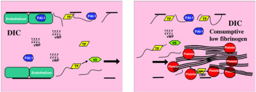

_Created with the rticles package in RStudio. <https://cran.r-project.org/web/packages/rticles>_

_Text based on plos sample manuscript, <https://journals.plos.org/ploscompbiol/s/latex>_

# Introduction

Physical interactions between human and viral proteins mediate viral pathogenesis...
 
The human pathogen Severe Acute Respiratory Syndrome Coronavirus 2 (SARS-CoV-2):
  - Viral myocardistis
  - Complement/coagulopathy
  - Epithelial/enteral/lung tropism [myeloid, mesoderm etc.?]
  - Innate/phagocytosis
  - ...

Critically ill COVID-19 patients experience coagulopathy. Recently named COVID-19 in some semi-official way, which I have cited in some bibtex file somewhere...

Protein-C activation is a hypothesis. I submitted some 20+ molecular docking jobs for various pairs of ORF3a (PDB ID: 6XDC) plus some-thrombotic-cascade-protein and saved the results, viewing the 3D renderings and looking through the scores for each pose.

That whole project is I think on the order of giga-bytes. I think I may have flagged the admin with all the jobs I was submitting (I hope they didnt take it down cuz of me), but in any case, that server is no longer live since I last checked around 01/04/2021 .

#### [Figure 1] An example caption describing DIC, which as I recall, was neither present in any analysis that I breifly viewed nor suspected to be characteristic of COVIF-19 coagulopathy among the majority of literature.

{ height=25% width=95%% }

I pursued complement, mannose binding-lectin/R, MAC complex, uPAR, FXa/extrinsic, Protein-C interactions at the membrane (EPCR, thrombin, thrombomodulin and EGF-like membrane proteins, etc.), platelets including endo/phagosomally.q 

Cytoplasmic interactions are represented fairly well in ELM. The 3D structure of ORF3a itself conveys these interaction domains well. Annotations for interactors are available, along with mappings to KEGG and Reactome.

#### Reactom images

Note that I can only render one color of highlight in Reactome images, so if the experimental method (affinity capture, yeast two-hybrid, etc.) is not noted somewhere one of my Reactome diagrams, it is "invalid", ignore it. Could be anything.

#### KEGG images

I can indeed render different colors with the KEGG API, just not with the Reactome API yet. If my KEGG images have only one color, the experimental method used to collect the presented data was affinity capture mass-spec. only and not proximity label mass-spec. A key would be nice. Can do. Cool.

## SARS-CoV-2 biology

### Structural genome

### Viral lifecycle

### Host interactions

#### At the plasma membrane

Tyrosine phosphorylation via SRC-homology domains.

#### Self interactions

#### Background interactions

#### Innate immunity

#### Adaptive immune response

## COVID-19 Disease

### Inflammator mediatiors

### COVID-19 Coagulopathy

### Immunological complications

#### Innate immune response

MIF

AHCYL1/PLD3/PLD1

#### Adaptive immune response

PTPRJ

#### Neutrophil extracellular traps

### Neurological complications

SNAP25, EFN/EFNB, spastic paraplegia, general SNARE/synaptic membrane complex

Opsin/coils(?)

#### Involvement at the cytoplasmic membrane

#### Sympathetic storm (?)

## ~Experimental data

### Affinity Capture-MS

### Proximity Label-MS

## ~Annotation data

### Sequence motifs

### Structural domains

### Interaction networks

### Disease ontologies

# Methods

## Protein annotations

### GO families

### ELM motifs

### Cell signature

## Comparative analysis

### Statistical utilities

The `clusterProfiler` package performed most gene set comparisons. 

#### Bonferroni corrected

#### Benj./Hochberg corrected

## Network analysis

# Results

# Discussion

## Limitations

# References {#references .unnumbered}
