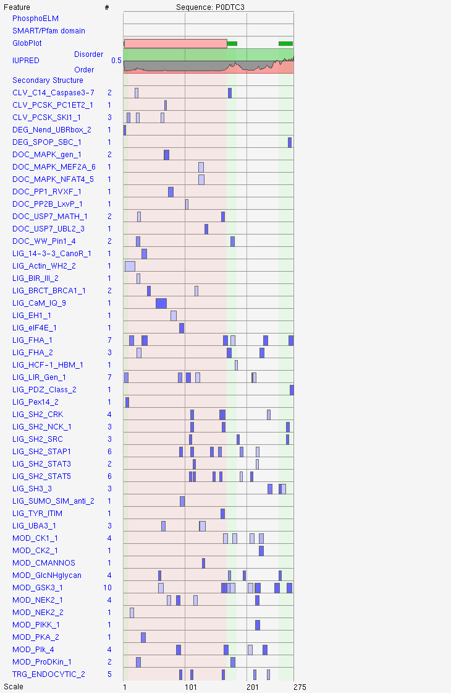

# About

A collection of subroutines used to generate myriad views and analyses of the BioGRID COVID-19 project dataset.

#### WARNING: 

Many of the blocks in this document make network requests that return data on the order of MBs and GBs. If you decide to knit the document from top to bottom, expect to wait for over an hour.


[http://www.pathguide.org/](http://www.pathguide.org/)
[http://ftp.ebi.ac.uk/pub/databases/](http://ftp.ebi.ac.uk/pub/databases/)


Bioconductor package: [ELMER](https://bioconductor.org/packages/devel/bioc/vignettes/ELMER/inst/doc/analysis_motif_enrichment.html)
Bioconductor package: [MotifDb](https://bioconductor.org/packages/release/bioc/vignettes/MotifDb/inst/doc/MotifDb.html)
Bioconductor package: [motifmatchr](https://bioconductor.org/packages/release/bioc/html/motifmatchr.html)


```{r setup, include=F}
library(kableExtra)
knitr::opts_chunk$set(
  collapse = TRUE,
  comment = "#>"
)
```

```{r version, echo=T}
print(version)
```

# Globals

```{r globals, eval=T}
SUPP_DIR <- normalizePath(paste(getwd(), "Supplementary", sep = "/"))
DATA_DIR <- normalizePath(paste(SUPP_DIR, "data", sep = "/"))
DATA_RAW <- normalizePath(paste(SUPP_DIR, "data-raw", sep = "/"))

INTERPRO_BROWSE_DIR <- paste(DATA_RAW, "InterPro/Browse/", sep ="/")
MAAYAN_GMT_DIR <- paste(DATA_RAW, "maayanlab.cloud", sep = "/")
```

# Imports

```{r}
devtools::install_github("reactome/ReactomeContentService4R")
library(ReactomeContentService4R)
```

```{r ch00_CRAN, out.extra=F}
library(grDevices)
library(data.table)
library(stringr)
library(dplyr)
```

```{r ch00_Bioc_installDeps, eval=F, include=F, out.extra=F}
if(!requireNamespace("BiocManager", quietly = F))
  install.packages("BiocManager")

BiocDeps <- c(
  "Structstrings", 
  "rGADEM", 
  "seqLogo", 
  "biomaRt", 
  "ReactomePA", 
  "DOSE", 
  "clusterProfiler",
  "ensembldb",
  "org.Hs.eg.db",
  "MotifDb"
)

BiocManager::install(BiocDeps, update = F, ask = F, checkBuilt = F)

for (biocdep in BiocDeps) 
  do.call("library", list(biocdep))
```

```{r , eval=T, include=T, out.extra=F}
library(Biostrings)
library(biomaRt)
# library(rGADEM)
library(DOSE)
library(ReactomePA)
library(clusterProfiler)
library(EnsDb.Hsapiens.v86)
library(org.Hs.eg.db) 
```

```{r ch00_useEnsemble_Ensembl, out.extra=F}
Ensembl.Hs.Mart <- biomaRt::useEnsembl(
  biomart="ENSEMBL_MART_ENSEMBL",
  dataset="hsapiens_gene_ensembl"
)
```

# Methods

```{r}
Enrichment.grepResult <- function(
  pattern, enrichment, .column = "Description", ...
) {
  result <- slot(enrichment, "result")
  result[grepl(pattern, result[[.column]], ...),]
}

Enrichment.geneIDtoVec <- function(enrichResult, .column = "geneID") {
  apply(
    as.data.frame(enrichResult), 1,
    function(row) {
      eval(
        parse(
          text = sprintf("c('%s')", gsub("/", "','", row[[.column]]))
        )
      )
    }
  )
}
```

```{r}
UniProt.fetchSequence <- function(accession) {
  fname <- sprintf("%s.fasta", accession)
  tempf <- tempfile(fname)
  url <- sprintf("https://www.uniprot.org/uniprot/%s", fname)
  download.file(url, tempf)
  Biostrings::readAAStringSet(tempf, format = "fasta")
}

UniProt.fetchSequencesInCategory <- function(enrichment, category) {
  GiC <- DOSE::genesInCategory(enrichment)
  lapply(
    c(category),
    function(cid) {
      geneids <- GiC[[cid]]
      lapply(
        geneids,
        function(gid) {
          uids <- clusterProfiler::bitr(gid, "ENTREZID", "UNIPROT")   
          lapply(uids, UniProt.fetchSequence)
        }
      )
    }
  )
}
```

```{r}
Pfam.fetchDescription <- function(pfam) {
  lapply(
    as.list(pfam),
    function(pfid) {
      tempf <- tempfile()
      html <- download.file(
        sprintf(
          "https://pfam.xfam.org/family/%s", trimws(pfid)
        ),
        destfile = tempf
      )
      doc <- xml2::read_html(tempf)
      pf.symbol <- xml2::xml_text(
        xml2::xml_find_first(
          doc,
          xpath = '//*[@id="tabTitle"]/h1/em'
        )
      )
      pf.short_description <- xml2::xml_text(
        xml2::xml_find_first(
          doc,
          xpath = '//*[@id="familySummaryBlock"]/div[1]/h1'
        )
      )
      pf.description <- xml2::xml_text(
        xml2::xml_find_first(
          doc,
          xpath = '//*[@id="wpContent0"]/div[2]/div/table/tbody/tr[2]/td/div'
        )
      )
      data.frame(
        symbol = pf.symbol,
        short_description = gsub("Summary: ", "", pf.short_description),
        description = pf.description
        # TODO::
        ## Might as well grab the div.infobox elements too while youre here
      )
    }
  )
}
```

```{r}
CDD.fetchDescription <- function(cdd) {
  title <- tryCatch(
    {
      xml2::xml_text(
        xml2::xml_find_first(
          x = xml2::read_html(
            httr::GET(
              paste0("https://www.ncbi.nlm.nih.gov/Structure/cdd/", cdd)
            )
          ),
          xpath = "/html/head/title"
        )
      )
    },
    error = function(e) NA_character_
  )
  if (is.na(title)) return(list(title))
  setNames(
    list(
      gsub("CDD Conserved Protein Domain Family: ", "", title)
    ), 
    cdd
  )
}
```

```{r}
InterPro.loadProwlerResultsFromBrowseDir <- function(BrowseResultsDir = NULL) {
 prowlerResults.json <- list.files(INTERPRO_BROWSE_DIR)
  setNames(
    lapply(
      as.list(prowlerResults.json),
      function(prowlerResult) {
        prowlerResult.file <- paste(INTERPRO_BROWSE_DIR, prowlerResult, sep ="")
        print(prowlerResult.file)
        rjson::fromJSON(file = normalizePath(prowlerResult.file))
      }
    ),
    gsub("\\..json", "", prowlerResults.json)
  )
}
```

```{r}
.fetchPNGURI <- function(keggurl) {
  res <- httr::GET(keggurl)
  doc <- httr::content(res, as = "parsed")
  img <- xml2::xml_find_first(doc, xpath = './/img[@id="pathwayimage"]')
  src <- xml2::xml_attr(img, attr = "src")
  paste0("https://www.kegg.jp", src)
}

KEGG.encodeHighlightURL <- function(pathway, genes, bg.color, fg.color, text.color) {
	#' @example \code{ KEGG.encodeHighlightURL("map05171", list("hsa:6868"), "white", "blue", "yellow") }
	paste(
		paste0("http://www.kegg.jp/kegg-bin/show_pathway?", pathway),
		paste(
			sapply(
				KEGGREST::keggLink("ko", genes),
				function(g) {
					paste(c(g), collapse="")
				}
			),
			collapse ="/"
		),
		sep="/"
	)
}

KEGG.downloadGiCPNG <- function(enrichment, category) {
  keggPNG <- .fetchPNGURI(
      KEGG.encodeHighlightURL(
        category, 
        paste("hsa:", c(DOSE::geneInCategory(enrichment)[[category]]), sep = ""),
        "white", "blue", "red"
      )
    )
  download.file(
    keggPNG, destfile = paste(DATA_DIR, sprintf("%s.png", category), sep = "/")
  )
}
```

```{r}
ELM.match <- function(aastring, pattern) {
  if (length(aastring) < 1) 
    return(NULL)
  
  if (!any(grepl(pattern, aastring))) 
    return(rep(NA_character_, times = length(aastring)))
  
  matches <- regmatches(aastring, regexec(pattern, aastring))
  
  if (length(names(aastring)) == length(matches)) 
    names(matches) <- names(aastring)
  
  return(matches)
}

ELM.mask <- function(aastringset, pattern) {
  motif.matches <- ELM.match(aastringset, pattern)
  lapply(as.list(aastringset), function(aaseq) {
    Biostrings::mask(aaseq, motif.matches[[i]])
  })
}
  
ELM.extract <- function(aastring, pattern) {
  if (!inherits(pattern, c("regex", "pattern"))) {
    pattern <- stringr::regex(as.character(pattern))
  }
  stringr::str_extract_all(as.character(aastring), unique(c(pattern)))
}

ELM.occurrences <- function(aastring, elm) {
  stringr::str_count(as.character(aastring), elm)
}

ELM.searchUniProt <- function(uniprotid) {
  tempf <- tempfile(uniprotid)
  download.file(
    sprintf("http://elm.eu.org/start_search/%s.tsv", uniprotid), 
    destfile = tempf
  )
  read.delim(tempf)
}

ELM.fetchTSV <- function(url) {
  tempf <- tempfile()
  download.file(url, destfile = tempf)
  read.delim(tempf)
}

ELM.fetchGO <- function(...) {
  ELMdb.fetchTSV("http://elm.eu.org/goterms.tsv")
}

ELM.fetchKEGG <- function(...) {
  # http://elm.eu.org/kegg_terms.html
  ELMdb.fetchTSV("http://elm.eu.org/kegg_terms.tsv")
}

ELM.fetchReactome <- function(...) {
  # http://elm.eu.org/reactome_terms.html
  ELMdb.fetchTSV("http://elm.eu.org/reactome_terms.tsv")
}

ELM.fetchInteractions <- function(elmint) {
  xml2::download_xml(
    sprintf(
      "http://elm.eu.org/interactions/%s.xml", 
      as.character(trimws(elmint))
    )
  )
}
```

## De-novo motif discovery

### rGADEM

De-novo motif discovery with Bioconductor package [rGADEM](https://bioconductor.org/packages/release/bioc/html/rGADEM.html).

[rGADEM documentation](https://bioconductor.org/packages/release/bioc/vignettes/rGADEM/inst/doc/rGADEM.pdf)

```{r , eval=F}
# readPWMfile(system.file("extdata/jaspar2009.txt",package="rGADEM"))
```


```{r , eval=F}
# gadem<-GADEM(Sequences,verbose=1,genome=Hsapiens,Spwm=STAT1.PWM, fixSeeded=TRUE)
# gadem<-GADEM(Sequences,verbose=1,genome=Hsapiens,Spwm=STAT1.PWM)
```

# Data

## BioGRID v4.3 

### COVID-19 project, release 4

```{r}
INTERACTIONS <- read.delim(normalizePath(paste(DATA_RAW, "BIOGRID-PROJECT-covid19_coronavirus_project-LATEST/BIOGRID-PROJECT-covid19_coronavirus_project-INTERACTIONS-4.3.194.tab3.txt", sep = "/")))
GENES <- read.delim(normalizePath(paste(DATA_RAW,"BIOGRID-PROJECT-covid19_coronavirus_project-LATEST/BIOGRID-PROJECT-covid19_coronavirus_project-GENES-4.3.194.projectindex.txt", sep = "/")))
```

```{r , eval=F, include=F}
saveRDS(INTERACTIONS, file = paste(DATA_DIR, "INTERACTIONS.rds", sep = "/"))
saveRDS(GENES, file = paste(DATA_DIR, "GENES.rds", sep = "/"))
```

```{r ch01_BGData_glimpse, eval=F}
# dplyr::glimpse(GENES)
# dplyr::glimpse(INTERACTIONS)
```

```{r ch01_BGData_summary}
summary(GENES, maxsum = 4)
summary(INTERACTIONS, maxsum = 4)
```

```{r SARS2.Hs}
SARS2.Hs <- INTERACTIONS %>% 
  dplyr::filter(
    Organism.Name.Interactor.A == "Severe acute respiratory syndrome coronavirus 2"
    & Organism.Name.Interactor.B == "Homo sapiens"
    & Throughput == "High Throughput"
    & Experimental.System %in% c(
      "Proximity Label-MS",
      "Affinity Capture-MS"
    )
  )
```

```{r}
SARS2.ORF3a.Hs <- SARS2.Hs %>% 
  dplyr::filter(Official.Symbol.Interactor.A == "ORF3a")
SARS2.ORF3a.Hs.Entrez <- as.character(
  SARS2.ORF3a.Hs[["Entrez.Gene.Interactor.B"]]
)

SARS2.ORF3a.Hs.Background <- SARS2.Hs %>% 
  dplyr::filter(!(Official.Symbol.Interactor.A %in% c("", "ORF3a")))
SARS2.ORF3a.Hs.Background.Entrez <-  as.character(
  SARS2.ORF3a.Hs.Background[["Entrez.Gene.Interactor.B"]]
)
```

```{r}
SARS2.ORF3a.Hs.ACMS <- SARS2.ORF3a.Hs %>% 
  dplyr::filter(
    Experimental.System == "Affinity Capture-MS"
  )
SARS2.ORF3a.Hs.ACMS.Entrez <- as.character(
  SARS2.ORF3a.Hs.ACMS[["Entrez.Gene.Interactor.B"]]
)

SARS2.ORF3a.Hs.ACMS.Background <- SARS2.ORF3a.Hs.Background %>%
  dplyr::filter(
    Experimental.System == "Affinity Capture-MS"
  )
SARS2.ORF3a.Hs.ACMS.Background.Entrez <- as.character(
  SARS2.ORF3a.Hs.ACMS.Background[["Entrez.Gene.Interactor.B"]]
)
```

```{r}
SARS2.ORF3a.Hs.PXML <- SARS2.ORF3a.Hs %>% 
  dplyr::filter(
    Experimental.System == "Proximity Label-MS"
  )
SARS2.ORF3a.Hs.PXML.Entrez <-as.character(
  SARS2.ORF3a.Hs.PXML[["Entrez.Gene.Interactor.B"]]
)
  
SARS2.ORF3a.Hs.PXML.Background <- SARS2.ORF3a.Hs.Background %>%
  dplyr::filter(
    Experimental.System == "Proximity Label-MS"
  )
SARS2.ORF3a.Hs.PXML.Background.Entrez <- as.character(
  SARS2.ORF3a.Hs.PXML.Background[["Entrez.Gene.Interactor.B"]]
)
```

```{r ch01_ExpSum}
SARS2.ORF3a.Hs %>%
    dplyr::filter(Entrez.Gene.Interactor.B != "") %>%
    dplyr::group_by(Experimental.System) %>% 
    dplyr::add_tally() %>% 
    dplyr::arrange(-n) %>%
    dplyr::select(Experimental.System, n) %>%
    dplyr::distinct(Experimental.System, .keep_all=T)
```

```{r}
SARS2.ORF3a.Hs %>% 
  dplyr::select(
    Official.Symbol.Interactor.A,
    Official.Symbol.Interactor.B,
    Organism.Name.Interactor.A,
    Organism.Name.Interactor.B,
    Experimental.System,
    Author
  ) %>%
  summary()
```

```{r}
data.table::fwrite(
  as.list(SARS2.ORF3a.Hs.Entrez),
  file = paste(DATA_DIR, "GeneList.txt", sep ="/")
)
```

```{r}
save(SARS2.Hs, file = paste(DATA_DIR, "SARS2.Hs.rds", sep = "/"))
save(SARS2.ORF3a.Hs, file = paste(DATA_DIR, "SARS2.ORF3a.Hs.rds", sep = "/"))
save(SARS2.ORF3a.Hs.Background, file = paste(DATA_DIR, "SARS2.ORF3a.Hs.Background.rds", sep = "/"))
```

## UniProt 

### SARS-CoV-2 proteome

```{r}
SARS2.aaseq <- Biostrings::readAAStringSet(
  normalizePath(
    paste(DATA_RAW, "UniProt/uniprot-proteome_UP000464024.fasta", sep = "/")
  )
)
```

# Results

Read GMT files with [clusterProfiler::read.gmt()](https://yulab-smu.top/biomedical-knowledge-mining-book/useful-utilities.html#read-gmt).

## Molecular signatures

### MSigDB 

[https://www.gsea-msigdb.org/gsea/msigdb/](https://www.gsea-msigdb.org/gsea/msigdb/)

MSigDB: [Collections](https://www.gsea-msigdb.org/gsea/msigdb/collections.jsp)

MSigDB collection: [HALMARK](https://www.gsea-msigdb.org/gsea/msigdb/genesets.jsp?collection=H)

MSigDB collection card: [HALLMARK_COAGULATION](https://www.gsea-msigdb.org/gsea/msigdb/cards/HALLMARK_COAGULATION)

```{r}
SARS2.ORF3a.Hs.MSigDB <- readRDS(paste(DATA_DIR, "SARS2.ORF3a.Hs.MSigDB.rds", sep = "/"))
```

```{r , eval=F}
categories <- c("C2", "C5", "C7", "C8", "H")

SARS2.ORF3a.Hs.MSigDB <- list()

for (category in categories) {
  msg2gene <- msigdbr::msigdbr(
    species = "Homo sapiens", category = category
  ) %>% 
    dplyr::select("gs_name", "entrez_gene")
  
  enrichresult <- clusterProfiler::enricher(
    SARS2.ORF3a.Hs.Entrez, TERM2GENE=msg2gene
  )
  
  SARS2.ORF3a.Hs.MSigDB[[category]] <- enrichresult
}
```

```{r}
saveRDS(SARS2.ORF3a.Hs.MSigDB, file = paste(DATA_DIR, "SARS2.ORF3a.Hs.MSigDB.rds", sep = "/"))
```

#### HALLMARK enrichment

```{r}
SARS2.ORF3a.Hs.MSigDB.H <- clusterProfiler::setReadable(
  SARS2.ORF3a.Hs.MSigDB[["H"]], OrgDb = org.Hs.eg.db, keyType = "ENTREZID"
)
```

```{r}
SARS2.ORF3a.Hs.MSigDB.H@result %>% 
  dplyr::filter(Description == "HALLMARK_COAGULATION")
DOSE::geneInCategory(SARS2.ORF3a.Hs.MSigDB.H)[["HALLMARK_COAGULATION"]]
```

```{r}
SARS2.ORF3a.Hs.MSigDB.H@result %>% 
  dplyr::filter(Description == "HALLMARK_COMPLEMENT")
DOSE::geneInCategory(SARS2.ORF3a.Hs.MSigDB.H)[["HALLMARK_COMPLEMENT"]]
```

```{r}
readRDS(paste(DATA_DIR, "SARS2.ORF3a.Hs.MSigDB.rds", sep = "/"))
```

### GE-lab datasets

[Gene sets from ge-lab.org](http://ge-lab.org/#/data)

### OncoPPi datasets

[All datasets](http://oncoppi.emory.edu/index.php?navigation=ppi_datasets&location=ppi_datasets)
[Network viewer](http://oncoppi.emory.edu/index.php?navigation=networks&location=projects&section=explore&ppihub=oncoppiv1#content1_explore_projects_header1)

### Maayan-lab datasets

[All Maayan-lab resources](https://labs.icahn.mssm.edu/maayanlab/resources/)

[Enrichr gene sets](https://maayanlab.cloud/Enrichr/#stats)
[COVID-19 drug and gene sets](https://maayanlab.cloud/covid19/)


[GEO2Enrichr web server](https://amp.pharm.mssm.edu/g2e/)
[Network2Canvas we server](https://www.maayanlab.net/N2C/#.WE8Y4dIrKyp)
[PAEA enrichment web server](https://amp.pharm.mssm.edu/PAEA/)

[Harmonize datasets](https://maayanlab.cloud/Harmonizome/download)
[Harmonize API](https://maayanlab.cloud/Harmonizome/documentation)

[Geneshot](https://amp.pharm.mssm.edu/geneshot/)

```{r}
COVID19_GeneSets.gmt <- paste(MAAYAN_GMT_DIR, "COVID19_GeneSets.gmt", sep = "/")

download.file(
  "https://maayanlab.cloud/Enrichr/geneSetLibrary?mode=text&libraryName=COVID-19_Related_Gene_Sets", 
  destfile = COVID19_GeneSets.gmt
)
```

```{r , out.extra=F, warning=F, message=F}
COVID19_GeneSets <- read.gmt(COVID19_GeneSets.gmt) 
COVID19_GeneSets <- clusterProfiler::bitr(
  COVID19_GeneSets[["gene"]], fromType="SYMBOL", toType="ENTREZID", org.Hs.eg.db
) %>% 
  dplyr::left_join(
    COVID19_GeneSets, by = c("SYMBOL" = "gene")
  )

ont2gene <- COVID19_GeneSets[, c("ont", "ENTREZID")]

SARS2.ORF3a.Hs.Maayan <- clusterProfiler::enricher(
  SARS2.ORF3a.Hs.Entrez,
  universe = SARS2.ORF3a.Hs.Background.Entrez,
  minGSSize = 3, qvalueCutoff = 0.36, pAdjustMethod = "BH", 
  TERM2GENE = ont2gene
)
```

```{r}
saveRDS(SARS2.ORF3a.Hs.Maayan, paste(DATA_DIR, "SARS2.ORF3a.Hs.Maayan.rds", sep ="/"))
```

```{r}
SARS2.ORF3a.Hs.Maayan <- clusterProfiler::setReadable(
  SARS2.ORF3a.Hs.Maayan, org.Hs.eg.db, keyType = "ENTREZID"
)

head(SARS2.ORF3a.Hs.Maayan@result, 10)
```

#### ChEA Transcription Factor Targets

[maayanlab.cloud/Harmonizome/dataset/CHEA+Transcription+Factor+Targets](https://maayanlab.cloud/Harmonizome/dataset/CHEA+Transcription+Factor+Targets)

## DOSE

### DOSE - DO 

```{r}
SARS2.ORF3a.Hs.KEGG.DO <- DOSE::enrichDO(SARS2.ORF3a.Hs.Entrez)
SARS2.ORF3a.Hs.KEGG.DO@result
```

### DOSE - DGN

```{r}
SARS2.ORF3a.Hs.KEGG.DGN <- DOSE::enrichDGN(SARS2.ORF3a.Hs.Entrez)
SARS2.ORF3a.Hs.KEGG.DGN@result
```

### DOSE - NCG

```{r}
SARS2.ORF3a.Hs.KEGG.NCG <- DOSE::enrichNCG(SARS2.ORF3a.Hs.Entrez)
SARS2.ORF3a.Hs.KEGG.NCG@result
```

## InterPro enrichment

```{r , eval=T, include=F}
SARS2.ORF3a.Hs.InterPro <- readRDS(paste(DATA_DIR, "SARS2.ORF3a.Hs.InterPro.rds", sep = "/"))
```

```{r , eval=F, include=T}
SARS2.ORF3a.Hs.InterPro <- biomaRt::getBM(
  values = list(
    "entrezgene_id" = unique(
      c(SARS2.ORF3a.Hs.Entrez, SARS2.ORF3a.Hs.Background.Entrez)
    )
  ),
  attributes = c(
   "entrezgene_id", "interpro", "interpro_description"
  ),
  filters = "entrezgene_id",
  mart = Ensembl.Hs.Mart,
  useCache = FALSE
)
```

```{r}
saveRDS(SARS2.ORF3a.Hs.InterPro, file = paste(DATA_DIR, "SARS2.ORF3a.Hs.InterPro.rds", sep = "/"))
```

```{r}
ipr2name <- SARS2.ORF3a.Hs.InterPro %>%
  dplyr::select("interpro", "interpro_description")
ipr2gene <-SARS2.ORF3a.Hs.InterPro %>% 
  dplyr::select("interpro", "entrezgene_id") %>%
  dplyr::mutate(gene = entrezgene_id)

SARS2.ORF3a.Hs.InterPro.Enrichment <- clusterProfiler::enricher(
  SARS2.ORF3a.Hs.ACMS.Entrez,
  universe = SARS2.ORF3a.Hs.ACMS.Background.Entrez,
  pvalueCutoff = 0.9,
  qvalueCutoff = 0.9,
  pAdjustMethod = "BH",
  TERM2GENE=ipr2gene,
  TERM2NAME=ipr2name
)
```

```{r, include=F}
saveRDS(SARS2.ORF3a.Hs.InterPro.Enrichment, file = paste(DATA_DIR, "SARS2.ORF3a.Hs.InterPro.Enrichment.rds", sep = "/"))  
```

```{r, include=F}
SARS2.ORF3a.Hs.InterPro.Enrichment <- readRDS(paste(DATA_DIR, "SARS2.ORF3a.Hs.InterPro.Enrichment.rds", sep = "/"))
```

```{r}
SARS2.ORF3a.Hs.InterPro.Enrichment %>%
  DOSE::setReadable(org.Hs.eg.db, "ENTREZID") %>% slot("result") %>%
  dplyr::filter(Count >= 3) %>% 
  dplyr::arrange(-Count)
```

```{r}

clusterProfiler::emapplot(SARS2.ORF3a.Hs.InterPro.Enrichment)
clusterProfiler::heatplot(
  clusterProfiler::setReadable(SARS2.ORF3a.Hs.InterPro.Enrichment, OrgDb = org.Hs.eg.db, keyType = "ENTREZID")
)
```


```{r IntperProEnrichmentToI, eval=F}
ToI.immunological <- c(
  "EGF",
  "PDZ",
  "Cadherin"
)

SARS2.ORF3a.Hs.InterPro.Enrichment.ToI <- setNames(
  lapply(
    ToI.immunological, 
    function(toi) {
      SARS2.ORF3a.Hs.InterPro.Enrichment.GinC[
        grepl(toi, SARS2.ORF3a.Hs.InterPro.Enrichment@result[["Description"]])
      ]
    }
  ),
  ToI.immunological
)

SARS2.ORF3a.Hs.InterPro.Enrichment.ToI.barplots <- lapply(
  names(SARS2.ORF3a.Hs.InterPro.Enrichment.ToI), 
  function(toi) {
    iprgenes <- SARS2.ORF3a.Hs.InterPro.Enrichment.ToI[[toi]]
    tryCatch(
      barplot(
        unlist(lapply(iprgenes, length)), 
        names.arg = names(iprgenes),
        main = ToI, legend.text = toi, args.legend = list(x = "right", y = "top")
      ),
      error = function(e) {
        # warning(e)
        NA_character_
      }
    )
  }
)

SARS2.ORF3a.Hs.InterPro.Enrichment.ToI.barplots
```

### PANTHER prowler

```{r ProwlerResults2, eval=F, include=F}
ProwlerResults <- list()

for (jsonfile in list.files(INTERPRO_BROWSE_DIR)) {
  if (!grepl(".json", jsonfile)) return(NULL)
  browseterm <- gsub(".json", "", jsonfile)
  jsonfpath <-  normalizePath(paste(INTERPRO_BROWSE_DIR, jsonfile, sep = "" ))
  ProwlerResults <- append(
    ProwlerResults,
    setNames(
      list(
        rjson::fromJSON(file = jsonfpath)
      ),
      as.character(browseterm)
    )
  )
}
```

```{r , eval=F}
prowlerresults <- InterPro.loadProwlerResultsFromBrowseDir()

ProwlerResults <- lapply(
    names(prowlerresults),
    function(JSONname) {
      setNames(
        lapply(prowlerresults[[JSONname]], dplyr::bind_cols),
        prowlerresults[[JSONname]]
      )
    }
  )
)
```

```{r , eval=T, include=F}
saveRDS(ProwlerResults, file = paste(DATA_DIR, "ProwlerResults.rds", sep = "/")
```

```{r , eval=F}
ProwlerToI <- list()

ProwlerToI.InterPro <- lapply(
  names(ProwlerResults), 
  function(term) {
    ProwlerToI.term <- data.frame()
    result <- ProwlerResults[[term]]
    for (i in 1:length(result)) {
      metadata <- result[[i]][["metadata"]]
      ProwlerToI.term <- rbind(
        ProwlerToI.term,
        data.frame(
          ID = metadata[["accession"]], 
          Description = metadata[["name"]], 
          Source = metadata[["source_database"]],
          Type = "domain",
          Query = term
        )
      )
    }
    ProwlerToI.term
  }
)
```

## Pfam

```{r , eval=T, include=F}
SARS2.ORF3a.Hs.Pfam.rds <- readRDS(SARS2.ORF3a.Hs.Pfam, file = paste(DATA_DIR, "SARS2.ORF3a.Hs.Pfam.rds", sep ="/"))
```

```{r , eval=F, include=T}
SARS2.ORF3a.Hs.Pfam <- biomaRt::getBM(
  values = list(
    "entrezgene_id" = c(
      SARS2.ORF3a.Hs.ACMS.Entrez, 
      SARS2.ORF3a.Hs.ACMS.Background.Entrez
    )
  ),
  attributes = c(
    "entrezgene_id", "pfam", "pfam_start", "pfam_end"
  ),
  filters = "entrezgene_id",
  mart = Ensembl.Hs.Mart,
  useCache = FALSE
)
```

```{r}
saveRDS(SARS2.ORF3a.Hs.Pfam, file = paste(DATA_DIR, "SARS2.ORF3a.Hs.Pfam.rds", sep ="/"))

SARS2.ORF3a.Hs.Pfam %>% 
  dplyr::grouped_df("pfam") %>%
  dplyr::tally()
```

```{r}
pfam2gene <- SARS2.ORF3a.Hs.Pfam %>% 
  dplyr::select("pfam", "entrezgene_id")

SARS2.ORF3a.Hs.Pfam.Enrichment <- clusterProfiler::enricher(
  unique(SARS2.ORF3a.Hs.ACMS.Entrez), 
  universe = unique(SARS2.ORF3a.Hs.ACMS.Background.Entrez),
  pvalueCutoff = 0.05, 
  pAdjustMethod = "none",
  TERM2GENE=pfam2gene
)

SARS2.ORF3a.Hs.Pfam.Enrichment.descriptions <- dplyr::bind_rows(
  Pfam.fetchDescription(
    SARS2.ORF3a.Hs.Pfam.Enrichment@result[["ID"]]
  )
)

SARS2.ORF3a.Hs.Pfam.Enrichment@result$Description <- SARS2.ORF3a.Hs.Pfam.Enrichment.descriptions$short_description

saveRDS(SARS2.ORF3a.Hs.Pfam.Enrichment, paste(DATA_DIR, "SARS2.ORF3a.Hs.Pfam.Enrichment.rds", sep = "/"))
```

## Reactome

[Neurophilin interactions with VEGF and VEGFR](https://reactome.org/content/detail/REACT_12473)

[https://reactome.org/content/schema/instance/browser/9683912](https://reactome.org/content/schema/instance/browser/9683912)

[https://www.ebi.ac.uk/interpro/entry/InterPro/IPR024407/pathways/#table](https://www.ebi.ac.uk/interpro/entry/InterPro/IPR024407/pathways/#table)

```{r}
SARS2.ORF3a.Hs.Reactome.Enrichment <- readRDS(paste(DATA_DIR, "SARS2.ORF3a.Hs.Reactome.Enrichment.rds", sep = "/"))
```

```{r , eval=F}
SARS2.ORF3a.Hs.Reactome.Enrichment <- ReactomePA::enrichPathway(
  gene = SARS2.ORF3a.Hs.Entrez, 
  universe = SARS2.ORF3a.Hs.Background.Entrez,
  organism = "human", 
  pvalueCutoff = 0.1, 
  qvalueCutoff = 0.36, 
  pAdjustMethod = "bonferroni", 
  minGSSize = 3,
  maxGSSize = 250, 
  readable = FALSE
)

SARS2.ORF3a.Hs.Reactome.Enrichment@result %>% dplyr::arrange(qvalue) %>% head(30)
```


```{r , eval=F}
saveRDS(SARS2.ORF3a.Hs.Reactome.Enrichment, file = paste(DATA_DIR, "SARS2.ORF3a.Hs.Reactome.Enrichment.rds", sep = "/"))
```

```{r}
SARS2.ORF3a.Hs.Reactome.Enrichment.GinC <- DOSE::geneInCategory(
  SARS2.ORF3a.Hs.Reactome.Enrichment
)
DOSE::mclusterSim(SARS2.ORF3a.Hs.Reactome.Enrichment.GinC)
```

```{r}
SARS2.ORF3a.Hs.Reactome.Enrichment.DOforGinC <- setNames(
  lapply(
    SARS2.ORF3a.Hs.Reactome.Enrichment.GinC, 
    function(rhsa) {
      genedo <- NA_character_
      if(length(rhsa) > 50) {
        genedo <- tryCatch(
          lapply(rhsa, DOSE::gene2DO),
          error = function(e) {
            NA_character_
          }
        )
      }
      return(genedo)
    }
  ),
  names(SARS2.ORF3a.Hs.Reactome.Enrichment.GinC)
)
```

```{r , eval=F, include=F}
# # NOT RUN
# saveRDS(SARS2.ORF3a.Hs.Reactome.Enrichment.DOforGinC, file = paste(DATA_DIR, "SARS2.ORF3a.Hs.Reactome.Enrichment.DOforGinC.rds", sep ="/")
```

```{r , include=F, eval=F}
# # NOT RUN
# fgridplot <- ggplot(
#   SARS2.ORF3a.Hs.Reactome.Enrichment
# )
# fggridplot + ggplot2::facet_grid
```

### Reactome enrichment ToI search

```{r }
Enrichment.grepResult(
  "hiv",
  DOSE::setReadable(
    SARS2.ORF3a.Hs.Reactome.Enrichment, 
    OrgDb = org.Hs.eg.db, 
    keyType = "ENTREZID"
  ), 
  ignore.case = T
) %>% dplyr::arrange(desc(Count))
```

```{r}
`Host Interactions of HIV factors` <- DOSE::geneInCategory(
  DOSE::setReadable(
    SARS2.ORF3a.Hs.Reactome.Enrichment,
    org.Hs.eg.db,
    keyType = "ENTREZID"
  )
)[["R-HSA-162909"]]

ReactomeContentService4R::exportImage(
  id = "R-HSA-162909", 
  format = "svg",
  output = "diagram",
  quality = 5,
  flg = paste(`Host Interactions of HIV factors`, collapse = ",")
)   

```

```{r}
Enrichment.grepResult(
  "influenza", 
  DOSE::setReadable(
    SARS2.ORF3a.Hs.Reactome.Enrichment, 
    OrgDb = org.Hs.eg.db, 
    keyType = "ENTREZID"
  ), 
  ignore.case = T
) %>% dplyr::arrange(qvalue)
```

```{r}
`Influenza Life Cycle` <- DOSE::geneInCategory(
  DOSE::setReadable(
    SARS2.ORF3a.Hs.Reactome.Enrichment,
    org.Hs.eg.db,
    keyType = "ENTREZID"
  )
)[["R-HSA-168255"]]

ReactomeContentService4R::exportImage(
  id = "R-HSA-168255", 
  format = "svg",
  output = "diagram",
  quality = 10,
  flg = paste(`Influenza Life Cycle`, collapse = ",")
)   
```

```{r}
Reactome.ToI <- c(
  "clot",
  "hemostasis",
  "platelet",
  "fibrosis",
  "fibronectin",
  "integrin",
  "thrombin",
  "plasmin",
  "thromboxane",
  "complement",
  "apoptosis",
  "autophag",
  "death",
  "inflamm",
  "antigen",
  "MHC",
  "CD4",
  "CD8",
  "innate",
  "adapt",
  "phago",
  "endocytosis",
  "import",
  "export",
  "membrane",
  "clathrin",
  "nef"
)

SARS2.ORF3a.Hs.Reactome.Enrichment.ToI <- setNames(
  lapply(
    Reactome.ToI,
    function(toi) {
      result <- Enrichment.grepResult(
        toi,
        DOSE::setReadable(
          SARS2.ORF3a.Hs.Reactome.Enrichment, 
          OrgDb = org.Hs.eg.db, 
          keyType = "ENTREZID"
        ),
        ignore.case = TRUE
      )
      dplyr::arrange(result, -Count)
    }
  ),
  Reactome.ToI
)

SARS2.ORF3a.Hs.Reactome.Enrichment.ToI[["hemostasis"]]
```

```{r , include=F, eval=T}
saveRDS(SARS2.ORF3a.Hs.Reactome.Enrichment.ToI, file = paste(DATA_DIR, "SARS2.ORF3a.Hs.Reactome.Enrichment.ToI.rds", sep = "/"))
```

```{r}
ToI.platelet <- Enrichment.geneIDtoVec(
  SARS2.ORF3a.Hs.Reactome.Enrichment.ToI[["platelet"]]
)

RCS4R.svg <- ReactomeContentService4R::exportImage(
  id = "R-HSA-76002", 
  format = "svg",
  output = "diagram",
  flg = paste(ToI.platelet[["R-HSA-76002"]], collapse = ",")
)

ToI.platelet["R-HSA-76002"]

RCS4R.svg
```

```{r}
ReactomeContentService4R::exportImage(
  id = "R-HSA-76002", 
  format = "svg",
  output = "diagram",
  flg = paste(ToI.platelet[["R-HSA-76002"]], collapse = ",")
)
```

```{r}
ToI.platelet.imgs <- lapply(
  names(ToI.platelet),
  function(stdid) {
    RCS4R.svg <- ReactomeContentService4R::exportImage(
      id = stdid, 
      format = "svg",
      output = "diagram",
      flg = paste(ToI.platelet[[stdid]], collapse = ",")
    )
  }
)
```

```{r}
SARS2.ORF3a.Hs.Reactome.Enrichment.ToI[["clot"]]

SARS2.ORF3a.Hs.Reactome.Enrichment.ToI.images <- setNames(
  lapply(
    names(SARS2.ORF3a.Hs.Reactome.Enrichment.ToI),
    function(toi) {
      ToI.genes <- Enrichment.geneIDtoVec(
        SARS2.ORF3a.Hs.Reactome.Enrichment.ToI[[toi]]
      )
      setNames(
        lapply(
          names(ToI.genes),
          function(stdid) {
            tryCatch(
              ReactomeContentService4R::exportImage(
                id = stdid, 
                format = "svg",
                output = "diagram",
                flg = paste(ToI.genes[[stdid]], collapse = ",")
              ),
              error = function(e) NA
            )
          }
        ),
        names(ToI.genes)
      )
    }
  ),
  names(SARS2.ORF3a.Hs.Reactome.Enrichment.ToI)
)

SARS2.ORF3a.Hs.Reactome.Enrichment.ToI.images
```

```{r}
saveRDS(SARS2.ORF3a.Hs.Reactome.Enrichment.ToI.images, paste(DATA_DIR, "SARS2.ORF3a.Hs.Reactome.Enrichment.ToI.images.rds", sep = "/"))
```

### Reactome ELM interactions

[ELMs grouped by KEGG pathway](http://elm.eu.org/pathways/index.html?q=Homo+sapiens)

[KEGG coagulation pathway with highlighted ELM instances](https://www.kegg.jp/kegg-bin/show_pathway?map=hsa04610&mapscale=1.0&show_description=hide&multi_query=hsa:2158+%23f781bf,black%0D%0Ahsa:2159+%23f781bf,black%0D%0Ahsa:5328+%23f781bf,black%0D%0Ahsa:5327+%23f781bf,black%0D%0Ahsa:735+%23f781bf,black%0D%0Ahsa:5624+%23f781bf,black%0D%0Ahsa:7450+%23ff6666,black%0D%0Ahsa:731+%23f781bf,black%0D%0Ahsa:732+%23f781bf,black%0D%0Ahsa:2155+%23f781bf,black%0D%0Ahsa:730+%23f781bf,black%0D%0Ahsa:729+%23f781bf,black%0D%0A)

```{r ch02_EnrichKEGG}
SARS2.ORF3a.Hs.KEGG <- clusterProfiler::enrichKEGG(
  gene = SARS2.ORF3a.Hs.Entrez, 
  universe = SARS2.ORF3a.Hs.Background.Entrez,
  organism = 'hsa', 
  minGSSize = 3,
  maxGSSize = 100, 
  pvalueCutoff = 1.0, 
  qvalueCutoff = 1.0,
  pAdjustMethod = "hochberg",
  use_internal_data = FALSE
)

SARS2.ORF3a.Hs.KEGG.qValid <- setReadable(
    SARS2.ORF3a.Hs.KEGG, OrgDb = org.Hs.eg.db, keyType = "ENTREZID"
  ) %>% 
  slot("result") %>%
  dplyr::filter(Count > 2 & qvalue < 1.0) %>% 
  dplyr::arrange(qvalue)


SARS2.ORF3a.Hs.KEGG.qValid
```

```{r}
PoI <- c(
  "hsa05163",
  "hsa05416",
  "hsa04350",
  "hsa04060"
)

PoI <- names(SARS2.ORF3a.Hs.KEGG@geneSets)

KEGG.downloadGiCPNG(SARS2.ORF3a.Hs.KEGG, "hsa04060")

lapply(PoI, function(category) { KEGG.downloadGiCPNG(SARS2.ORF3a.Hs.KEGG, category) })
```

```{r}
# hsa05416 - "Viral myocarditis"
unlist(
  lapply(
    DOSE::geneInCategory(SARS2.ORF3a.Hs.KEGG)[["hsa05416"]],
    function(entrezid) {
      DOSE::EXTID2NAME(org.Hs.eg.db, entrezid, keytype = "ENTREZID")       
    }
  )
)
```

```{r , eval=F, include=F}
SARS2.ORF3a.Hs.KEGG.qValid.geneSets <- SARS2.ORF3a.Hs.KEGG@geneSets[
  c(SARS2.ORF3a.Hs.KEGG.qValid[["ID"]])
]

SARS2.ORF3a.Hs.KEGG.qValid.GO <- clusterProfiler::compareCluster(
  SARS2.ORF3a.Hs.KEGG.qValid.geneSets,
  OrgDb = org.Hs.eg.db, fun = "groupGO", ont = "BP"
)

SARS2.ORF3a.Hs.KEGG.qValid.GO@compareClusterResult %>% 
  dplyr::arrange(-Count) %>% head(10)
```

```{r , eval=F, include=F}
SARS2.ORF3a.Hs.KEGG.qValid.geneSets.browserURLs <- setNames(
  lapply(
    names(SARS2.ORF3a.Hs.KEGG.qValid.geneSets),
    function(hsaid) {
      # clusterProfiler::bitr_kegg(as.character(hsaid), fromType = "kegg", toType = "kegg-pathway")
    }
  ),
  names(SARS2.ORF3a.Hs.KEGG.qValid.geneSets)
)
```

```{r}
SARS2.ORF3a.KEGG.qValid.imageURL <- NULL
```

```{r , eval=F, include=F}
DOSE::geneInCategory(
  SARS2.ORF3a.Hs.KEGG
)
SARS2.ORF3a.Hs.KEGG.groupGO <- clusterProfiler::groupGO(
  gene, 'org.Hs.eg.db', ont="CC", level=2
)
clusterProfiler::buildGOmap()
```

### KEGG enzymes with ELM annotations

[http://elm.eu.org/pathways/index.html?q=Homo+sapiens](http://elm.eu.org/pathways/index.html?q=Homo+sapiens)

```{r}
ELMdb.elm_keggs <- read.delim(paste(DATA_RAW, "elm.eu.org/elm_kegg.csv", sep = "/"))

SARS2.ORF3a.Hs.KEGG.GinC.proteins <- setNames(
  lapply(
    SARS2.ORF3a.Hs.KEGG@geneSets,
    function(genes) {
      ensembldb::proteins(
        EnsDb.Hsapiens.v86,
        columns = c(
          "entrezid", "symbol", "uniprot_id", "protein_sequence"
        ),
        filter = AnnotationFilter::EntrezFilter(genes)
      )
    }
  ),
  names(SARS2.ORF3a.Hs.KEGG@geneSets)
)

SARS2.ORF3a.Hs.KEGG.GinC.proteins.ELMs <- dplyr::bind_rows(
  lapply(
    names(SARS2.ORF3a.Hs.KEGG.GinC.proteins),
    function(keggid) {
      elmmatch <- SARS2.ORF3a.Hs.KEGG.GinC.proteins[[keggid]] %>%
        as.data.frame %>%
        dplyr::left_join(
          ELMdb.elm_keggs,
          by = c("uniprot_id")
        )
     return(elmmatch[!is.na(elmmatch$elm),])
    }
  )
)

SARS2.ORF3a.Hs.KEGG.GinC.proteins.ELMs %>%
  dplyr::filter(
    entrezid %in% c(SARS2.ORF3a.Hs.ACMS.Entrez)
  ) %>% dplyr::group_by(
    kegg_id
  ) %>% 
  dplyr::group_map(
    function(kegg, keggid){
      keggid
      kegg
      KEGG.
    }
  )
```

## WikiPathways

Render WikiPathways iframe highlighted by Entrez gene ID: [PathwayWidget documentation](https://www.wikipathways.org/index.php/PathwayWidget)

```{r ch03_WikiPathways}
WP.Hs.gmt <- clusterProfiler::read.gmt(
  "./Supplementary/data-raw/wikipathways-20201210-gmt-Homo_sapiens.gmt"
) %>% 
  tidyr::separate(ont, c("name","version","wpid","org"), "%") 

wpid2gene <- WP.Hs.gmt %>% dplyr::select(wpid, gene)
wpid2name <- WP.Hs.gmt %>% dplyr::select(wpid, name)

SARS2.ORF3a.Hs.WP <- clusterProfiler::enricher(
  SARS2.ORF3a.Hs.Entrez,
  universe = SARS2.ORF3a.Hs.Background.Entrez,
  qvalueCutoff = 0.36, pAdjustMethod = "hochberg", minGSSize = 13,
  TERM2GENE=wpid2gene, TERM2NAME=wpid2name,
)

SARS2.ORF3a.Hs.WP.qRanked <- SARS2.ORF3a.Hs.WP@result %>% dplyr::arrange(Count)
SARS2.ORF3a.Hs.WP.qRankID <- SARS2.ORF3a.Hs.WP.qRanked %>% dplyr::select(ID)

SARS2.ORF3a.Hs.WP.qTop_10 <- SARS2.ORF3a.Hs.WP.qRanked[1:10,]
SARS2.ORF3a.Hs.WP.qTop_20 <- SARS2.ORF3a.Hs.WP.qRanked[1:20,]
SARS2.ORF3a.Hs.WP.qTop_50 <- SARS2.ORF3a.Hs.WP.qRanked[1:50,]

kableExtra::kable(SARS2.ORF3a.Hs.WP.qTop_10)
```

```{r}
saveRDS(SARS2.ORF3a.Hs.WP, file = paste(DATA_DIR, "SARS2.ORF3a.Hs.WP.rds", sep = "/"))
```

```{r ch03_GOWikiPathways, eval=F}
# WP4217 - "Ebola virus pathway on host"
SARS2.ORF3a.Hs.WP.Pathways.GO <- clusterProfiler::compareCluster(
  SARS2.ORF3a.Hs.WP@geneSets[["WP4217"]],
  fun = "groupGO", ont = "BP",
  OrgDb = org.Hs.eg.db,
)

# setReadable(
#   SARS2.ORF3a.Hs.WP.Pathways.GO, 
#   OrgDb = org.Hs.eg.db, 
#   keyType = "ENTREZID"
# )
# 
# # SARS2.ORF3a.Hs.WP.Pathways.GO.Join <- dplyr::left_join(
# #   SARS2.ORF3a.Hs.WP@result,
# #   SARS2.ORF3a.Hs.WP.Pathways.GO@compareClusterResult,
# #   by = c("ID" = "Cluster")
# # ) %>%
# #   transmute(
# #     WP=ID, WP.Desc=Description.x,
# #     GO=ID.y, GO.Desc=Description.y
# #   ) %>%
# #   filter(WP.Desc == "Ebola Virus Pathway on Host")
```

## CDD

```{r , eval=F}
Ensembl.Hs.Mart.Entrez.CDD <- biomaRt::getBM(
  attributes = c(
    "entrezgene_id", "hgnc_symbol", "cdd"#, "cdd_start", "cdd_stop"
  ),
  values = c(
    "entrezgene_id" = c(
      SARS2.ORF3a.Hs.Entrez, SARS2.ORF3a.Hs.Background.Entrez
    )
  ),
  filters = "entrezgene_id",
  mart = Ensembl.Hs.Mart,
  useCache = FALSE
)

cdd2name <- Ensembl.Hs.Mart.Entrez.CDD %>%
  dplyr::select("cdd", "hgnc_symbol")

cdd2gene <- Ensembl.Hs.Mart.Entrez.CDD %>%
  dplyr::select("cdd", "entrezgene_id") %>%
  dplyr::mutate(gene = as.character(entrezgene_id))

SARS2.ORF3a.Hs.CDD.Enrichment <- clusterProfiler::enricher(
  unique(SARS2.ORF3a.Hs.ACMS.Entrez),
  universe = unique(SARS2.ORF3a.Hs.ACMS.Background.Entrez),
  minGSSize = 1, pvalueCutoff = 10, qvalueCutoff = 10, pAdjustMethod = "hochberg", 
  TERM2GENE=cdd2gene, TERM2NAME=cdd2name
)
```

```{r}
SARS2.ORF3a.Hs.CDD.Enrichment@result <- SARS2.ORF3a.Hs.CDD.Enrichment@result %>%
  dplyr::mutate(
    Description = unlist(lapply(ID, function(id) {
      tryCatch(
        sprintf("%s: %s", CDD.fetchDescription(id), id),
        error = function(e) NA_character_
      )
    }))
  ) %>%
  dplyr::arrange(-Count)

clusterProfiler::dotplot(SARS2.ORF3a.Hs.CDD.Enrichment)
clusterProfiler::heatplot(
  setReadable(
    SARS2.ORF3a.Hs.CDD.Enrichment, org.Hs.eg.db, keyType = "ENTREZID"
  ), 
  foldChange = SARS2.ORF3a.Hs.CDD.Enrichment@result[["pvalue"]]
)
```

```{r}
SARS2.ORF3a.Hs.CDD.Enrichment.GiC <- DOSE::geneInCategory(
  SARS2.ORF3a.Hs.CDD.Enrichment
)[Enrichment.grepResult("FN|Ig|EGF|WD", SARS2.ORF3a.Hs.CDD.Enrichment)[["ID"]]]

SARS2.ORF3a.Hs.CDD.Enrichment.GiC.groupGO <- clusterProfiler::compareCluster(
  SARS2.ORF3a.Hs.CDD.Enrichment.GiC, fun = "groupGO", OrgDb = org.Hs.eg.db
)

kableExtra::kable(
  SARS2.ORF3a.Hs.CDD.Enrichment.GiC.groupGO@compareClusterResult
)
```

## ProSite

```{r}
SARS2.ORF3a.Hs.PROSITE <- biomaRt::getBM(
  values = list(
    "entrezgene_id" = SARS2.ORF3a.Hs.ACMS.Entrez
  ),
  attributes = c(
    "entrezgene_id", "scanprosite", "scanprosite_start", "scanprosite_end"
  ),
  filters = "entrezgene_id",
  mart = Ensembl.Hs.Genes,
  useCache = FALSE
)

prosite2gene <- SARS2.ORF3a.Hs.PROSITE %>% 
  dplyr::transmute(
    "prosite" = prosite, 
    gene = as.character(entrezgene_id)
  )

SARS2.ORF3a.Hs.PROSITE.Enrichment <- clusterProfiler::enricher(
  as.character(SARS2.ORF3a.Hs.PROSITE$entrezgene_id), 
  pvalueCutoff = 0.05, pAdjustMethod = "none",
  TERM2GENE=prosite2gene
)

SARS2.ORF3a.Hs.PROSITE.Enrichment@result %>% 
  dplyr::arrange(-Count) %>%
  dplyr::select("ID", "GeneRatio", "p.adjust")
```

## GO

[GO utilities](https://yulab-smu.top/biomedical-knowledge-mining-book/useful-utilities.html#go-utilities)

### CC

```{r ch04_GOcc}
SARS2.ORF3a.Hs.GO.CC <- clusterProfiler::groupGO(
  as.character(SARS2.ORF3a.Hs.Entrez), 
  OrgDb=org.Hs.eg.db, ont="CC", level=2
) 

data.frame(SARS2.ORF3a.Hs.GO.CC) %>% 
  filter(Count < 1000 & Count > 10) %>%
  arrange(desc(Count))
```

```{r ch04_GOccHeat}
enrichplot::heatplot(SARS2.ORF3a.Hs.GO.CC)
```

```{r ch04_GOccEnrichment}
SARS2.ORF3a.Hs.GO.CC.Enrichment <- clusterProfiler::enrichGO(
  ont="CC",
  gene=SARS2.ORF3a.Hs.Entrez,
  OrgDb=org.Hs.eg.db,
  pAdjustMethod="BH",
  pvalueCutoff=0.05,
  qvalueCutoff=0.05
)

SARS2.ORF3a.Hs.GO.CC.Enrichment@result %>% arrange(p.adjust)
```

```{r ch04_GOccEmap}
clusterProfiler::emapplot(SARS2.ORF3a.Hs.GO.CC.Enrichment)
```

```{r ch04_GOccDot}
clusterProfiler::dotplot(SARS2.ORF3a.Hs.GO.CC.Enrichment)
```

### BP

```{r ch04_GObp}
SARS2.ORF3a.Hs.GO.BP <- clusterProfiler::groupGO(
  as.character(SARS2.ORF3a.Hs.Entrez), 
  OrgDb=org.Hs.eg.db, ont="BP", level=3
)
data.frame(SARS2.ORF3a.Hs.GO.BP) %>% 
  filter(Count < 100 & Count > 25) %>%
  arrange(desc(Count))
```

```{r ch04_GObpHeat}
enrichplot::heatplot(SARS2.ORF3a.Hs.GO.BP)
```

```{r ch04_GObpEnrichment}
SARS2.ORF3a.Hs.GO.BP.Enrichment <- clusterProfiler::enrichGO(
  ont="BP",
  gene=SARS2.ORF3a.Hs.Entrez,
  OrgDb=org.Hs.eg.db,
  pAdjustMethod="BH",
  pvalueCutoff=0.05,
  qvalueCutoff=0.05
)

SARS2.ORF3a.Hs.GO.BP.Enrichment@result %>% arrange(p.adjust)
```

```{r ch04_GObpEmap}
clusterProfiler::emapplot(SARS2.ORF3a.Hs.GO.BP.Enrichment)
```

```{r ch04_GObpDot}
clusterProfiler::dotplot(SARS2.ORF3a.Hs.GO.BP.Enrichment)
```

### MF

```{r CH04_GOmf}
SARS2.ORF3a.Hs.GO.MF <- clusterProfiler::groupGO(
  as.character(SARS2.ORF3a.Hs.Entrez), 
  OrgDb='org.Hs.eg.db', ont="MF", level=4
)
data.frame(SARS2.ORF3a.Hs.GO.MF) %>% 
  filter(Count < 1000 & Count > 10) %>%
  arrange(desc(Count))
# goplot(SARS2.ORF3a.Hs.GO.MF)
```

```{r}
enrichplot::heatplot(SARS2.ORF3a.Hs.GO.MF)
```

```{r}
SARS2.ORF3a.Hs.GO.MF.Enrichment <- clusterProfiler::enrichGO(
  gene=as.character(SARS2.ORF3a.Hs$Entrez.Gene.Interactor.B),
  ont="MF",
  pAdjustMethod="BH",
  pvalueCutoff=0.05,
  qvalueCutoff=0.05,
  OrgDb=org.Hs.eg.db
)
SARS2.ORF3a.Hs.GO.MF.Enrichment@result %>% arrange(p.adjust)
```

```{r}
clusterProfiler::emapplot(SARS2.ORF3a.Hs.GO.MF.Enrichment)
```

```{r}
clusterProfiler::dotplot(SARS2.ORF3a.Hs.GO.MF.Enrichment)
```

## Sequence analysis

```{r}
P0DTC3.aaseq <- UniProt.fetchSequence("P0DTC3")
P0DTC3.ELMs <- ELM.searchUniProt("P0DTC3")

print(P0DTC3.ELMs[,c("elm_identifier", "start", "stop")])
```

```{r}
saveRDS(P0DTC3.aaseq, file = paste(DATA_DIR, "P0DTC3.aaseq.rds", sep = "/"))
saveRDS(P0DTC3.ELMs, file = paste(DATA_DIR, "P0DTC3.ELMs.rds", sep = "/"))
```

```{r}
ELMdb.elm_classes <- read.delim(
  paste(SUPP_DIR, "/data-raw/elm.eu.org/elm_classes.tsv", sep ="/"), 
  skip = 5, row.names = NULL
)

P0DTC3.elm_classes <- ELMdb.elm_classes[
  apply(ELMdb.elm_classes, 1, function(elm_class) {
    matches <- ELM.match(P0DTC3.aaseq, elm_class[["Regex"]])
    if(all(is.na(matches))) return(F) else return(T)
  }),
]

print(P0DTC3.elm_classes)
```

```{r}
all(
  c(
    all(
      P0DTC3.elm_classes[["ELMIdentifier"]] %in% P0DTC3.ELMs[["elm_identifier"]]
    ),
    all(
      P0DTC3.ELMs[["elm_identifier"]] %in% P0DTC3.elm_classes[["ELMIdentifier"]]
    )
  )
)
```

# TODO:: Check these blocks !!!

```{r}
ELMdb.elm_interaction_domains <- read.delim(
  paste(DATA_RAW, "elm.eu.org/elm_interaction_domains.tsv", sep = "/")
)

P0DTC3.ELMs.interaction_domains <- ELMdb.elm_interaction_domains[
  ELMdb.elm_interaction_domains$ELM.identifier %in% P0DTC3.ELMs$elm_identifier,
]

SARS2.ORF3a.Hs.Pfam[
  SARS2.ORF3a.Hs.Pfam$pfam %in% P0DTC3.ELMs.interaction_domains$Interaction.Domain.Id,
]
```
```{r }
SARS2.ORF3a.Hs.Pfam.ELM_interaction_domains <- dplyr::left_join(
  SARS2.ORF3a.Hs.Pfam,
  P0DTC3.ELMs.interaction_domains,
  by = c("pfam" = "Interaction.Domain.Id")
) %>%
  dplyr::filter(!is.na(ELM.identifier))

P0DTC3.ELMs.Pfam_interaction_domains <- dplyr::left_join(
  P0DTC3.ELMs,
  SARS2.ORF3a.Hs.Pfam.ELM_interaction_domains,
  by = c("elm_identifier" = "ELM.identifier")
) %>%
  dplyr::filter(!is.na(pfam))

P0DTC3.ELMs.Pfam_interaction_domains
```

```{r}
# This is a tab formatted file. The .csv extension is erroneous.
ELMdb.elm_reactome <- read.delim(paste(DATA_RAW, "elm.eu.org/elm_reactome.csv", sep = "/"))
SARS2.ORF3a.Hs.Reactome.Enrichment <- readRDS(paste(DATA_DIR, "SARS2.ORF3a.Hs.Reactome.Enrichment.rds", sep = "/"))

SARS2.ORF3a.Hs.Reactome.Enrichment.geneSets.has_ELM <- 
  SARS2.ORF3a.Hs.Reactome.Enrichment@geneSets[
    names(SARS2.ORF3a.Hs.Reactome.Enrichment@geneSets) %in%
    gsub("\\.[1-10]", "", ELMdb.elm_reactome$pathway_id)
  ]

SARS2.ORF3a.Hs.Reactome.Enrichment.has_ELM <- 
  SARS2.ORF3a.Hs.Reactome.Enrichment@result %>%
    dplyr::filter(
      ID %in% names(SARS2.ORF3a.Hs.Reactome.Enrichment.geneSets.has_ELM)
    )

SARS2.ORF3a.Hs.Reactome.Enrichment.has_ELM %>%
  dplyr::select(
    ID, Description, Count
  )
```

### Rendered diagrams 

```{r}
`Nonsense Mediated Decay` <- DOSE::geneInCategory(
  DOSE::setReadable(
    SARS2.ORF3a.Hs.Reactome.Enrichment,
    org.Hs.eg.db,
    keyType = "ENTREZID"
  )
)[["R-HSA-975957"]]

ReactomeContentService4R::exportImage(
  id = "R-HSA-975957", 
  format = "svg",
  output = "diagram",
  quality = 5,
  flg = paste(`Nonsense Mediated Decay`, collapse = ",")
)
```

```{r}
`Cell surface interactinos at the vascular wall` <- 
  DOSE::geneInCategory(
    DOSE::setReadable(
      SARS2.ORF3a.Hs.Reactome.Enrichment,
      org.Hs.eg.db,
      keyType = "ENTREZID"
    )
  )[["R-HSA-202733"]]

ReactomeContentService4R::exportImage(
  id = "R-HSA-202733",
  format = "svg",
  output = "diagram",
  quality = 5,
  flg = paste(
    `Cell surface interactinos at the vascular wall`, collapse = ","
  )
)

P0DTC3.ELMs.ELMs.Pfam_interaction_domains %>%
  dplyr::filter(
    as.character(entrezgene_id) %in% 
      SARS2.ORF3a.Hs.Reactome.Enrichment@geneSets[["R-HSA-202733"]]
  ) 
```

```{r}
`IL-12 signalling` <- DOSE::geneInCategory(
  DOSE::setReadable(
    SARS2.ORF3a.Hs.Reactome.Enrichment,
    org.Hs.eg.db,
    keyType = "ENTREZID"
  )
)[["R-HSA-447115"]]

ReactomeContentService4R::exportImage(
  id = "R-HSA-447115",
  format = "svg",
  output = "diagram",
  quality = 5,
  flg = paste(
    `IL-12 signalling`, collapse = ","
  )
)
```

```{r}
`Thrombin signalling through PARs` <- DOSE::geneInCategory(
  DOSE::setReadable(
    SARS2.ORF3a.Hs.Reactome.Enrichment,
    org.Hs.eg.db,
    keyType = "ENTREZID"
  )
)[["R-HSA-456926"]]

ReactomeContentService4R::exportImage(
  id = "R-HSA-456926",
  format = "svg",
  output = "diagram",
  quality = 5,
  flg = paste(
    `Thrombin signalling through PARs`, collapse = ","
  )
)

`Thrombin signalling through PARs`
```

### ELM motifs



Search for ELM instances: 
[http://elm.eu.org/instances.html](http://elm.eu.org/instances/?q=TRAF2&instance_logic=true+positive&taxon=Homo+sapiens&submit=submit&reset_form=Reset).

View ELM disease ontologies:
[http://elm.eu.org/diseases/index.html](http://elm.eu.org/diseases/index.html#pathogens)

Submit genes to iELM (max = 400):
[First 400 from GeneList](http://i.elm.eu.org/proteomic_results/4972a9ee89b0aa5391a19b5c84ec5d9feed4ef9b)

```{r}
SARS2.ORF3a.Hs.ACMS.proteins <- readRDS(paste(DATA_DIR, "SARS2.ORF3a.Hs.ACMS.proteins", sep = "/"))
```

```{r eval=F}
SARS2.ORF3a.Hs.ACMS.proteins <- ensembldb::proteins(
  EnsDb.Hsapiens.v86,
  columns = c(
    "entrezid", "symbol", "gene_name", "uniprot_id", "protein_sequence"
  ),
  filter = EntrezFilter(SARS2.ORF3a.Hs.ACMS.Entrez)
)
```

```{r}
saveRDS(SARS2.ORF3a.Hs.ACMS.proteins, paste(DATA_DIR, "SARS2.ORF3a.Hs.ACMS.proteins", sep = "/"))
```

```{r}
SARS2.ORF3a.Hs.ACMS.proteins.ELMs <- readRDS(paste(DATA_DIR, "SARS2.ORF3a.Hs.ACMS.proteins.ELMs.rds", sep = "/"))
```

```{r , eval=F}
SARS2.ORF3a.Hs.ACMS.proteins.ELMs <- 
  apply(SARS2.ORF3a.Hs.ACMS.proteins, 1, function(protein) {
    do.call(
      rbind,
      suppressWarnings(
        apply(ELMdb.elm_classes, 1, function(elm) {
          elmrx <-  as.character(elm[["Regex"]])
          aaseq <- as.character(protein[["protein_sequence"]])
          
          N <- stringr::str_count(aaseq, elmrx)
          
          if (!N) return(
            data.frame(
              subseq = NULL,
              start = NULL,
              stop = NULL,
              elm = NULL,
              ensembl = NULL,
              entrez = NULL,
              uniprot = NULL
            )
          )
    
          accession <- elm[["Accession"]]
      
          elm.matches <- c(unlist(stringr::str_match_all(aaseq, elmrx)))
          elm.umatches <- c(na.omit(unique(elm.matches)))
          
          upositions <- stringr::str_locate_all(aaseq, elm.umatches)
          
          elm.positions <- do.call(
            rbind,
            lapply(1:length(upositions), function(i) {
              umatch <- elm.umatches[[i]]
              positions <- upositions[[i]]
              data.frame(
                subseq = rep(umatch, nrow(positions)),
                start = positions[,1],
                stop = positions[,2]
              )
            })
          )
          
          rownames(elm.positions) <- NULL
          
          ensembl <- as.character(protein[["protein_id"]])
          entrez <- as.character(protein[["entrezid"]])
          uniprot <- as.character(protein[["uniprot_id"]])
          
          ensembl <- ifelse(!length(ensembl), NA_character_, ensembl)
          entrez <- ifelse(!length(entrez), NA_character_, entrez)
          uniprot <- ifelse(!length(uniprot), NA_character_, uniprot)
      
          subseq.start <- elm.positions[,1]
          subseq.end <- elm.positions[,2]
          
          N <- nrow(elm.positions)
          
          cbind(
            data.frame(
              elm = rep(accession, N),
              ensembl = rep(ensembl, N),
              entrez = rep(entrez, N),
              uniprot = rep(uniprot, N)
            ),
            elm.positions
          )
        })
      )
    )
  })

SARS2.ORF3a.Hs.ACMS.proteins.ELMs <- do.call(
  rbind, SARS2.ORF3a.Hs.ACMS.proteins.ELMs
)
```

```{r}
saveRDS(SARS2.ORF3a.Hs.ACMS.proteins.ELMs, paste(DATA_DIR, "SARS2.ORF3a.Hs.ACMS.proteins.ELMs.rds", sep = "/"))
```

### ELM enrichment

```{r}
elm2gene <-SARS2.ORF3a.Hs.ACMS.proteins.ELMs %>% 
  dplyr::select("elm", "entrez")
elm2name <- SARS2.ORF3a.Hs.ACMS.proteins.ELMs %>%
  dplyr::left_join(ELMdb.elm_classes, by = c("elm" = "Accession")) %>%
  dplyr::select("elm", "ELMIdentifier")

SARS2.ORF3a.Hs.ACMS.proteins.ELMs.Enrichment <- clusterProfiler::enricher(
  SARS2.ORF3a.Hs.ACMS.Entrez,
  universe = SARS2.ORF3a.Hs.ACMS.Background.Entrez,
  pvalueCutoff = 0.9,
  qvalueCutoff = 0.9,
  pAdjustMethod = "bonferroni",
  TERM2GENE=elm2gene,
  TERM2NAME=elm2name
)

SARS2.ORF3a.Hs.ACMS.proteins.ELMs.Enrichment@result
```

### ELM PDBs

### iELM

### switches.ELM

[definitions.iSWitches](http://switches.elm.eu.org/index.php?page=definitions)

switches.ELM: ([A Smad action turnover switch operated by WW domain readers of a phosphoserine code.](http://switches.elm.eu.org/switch.php?switch=SWTI000279))

#### iELM PDBs representations

## Structural analysis

[https://www.ebi.ac.uk/interpro/protein/UniProt/?search=ORF3a](https://www.ebi.ac.uk/interpro/protein/UniProt/?search=ORF3a)

# Transmembrane helices

```{r eval=F}
SARS2.ORF3a.Hs.TMHMM <- biomaRt::getBM(
  values = list(
    "entrezgene_id" = c(
      SARS2.ORF3a.Hs.Entrez, SARS2.ORF3a.Hs.Background.Entrez
    )
  ),
  attributes = c("entrezgene_id", "tmhmm", "tmhmm_start", "tmhmm_end"),
  filters = "entrezgene_id",
  mart = Ensembl.Hs.Mart,
  useCache = FALSE
)

saveRDS(SARS2.ORF3a.Hs.TMHMM, paste(DATA_DIR, "SARS2.ORF3a.Hs.TMHMM.rds", sep = "/"))
```

### N-coils

```{r , eval=F}
SARS2.ORF3a.Hs.nCoils <- biomaRt::getBM(
  values = list(
    "entrezgene_id" = as.character(
      SARS2.ORF3a.Hs.Entrez, SARS2.ORF3a.Hs.Background.Entrez
    )
  ),
  attributes = c(
    "entrezgene_id", "ncoils", "ncoils_start", "ncoils_end"
  ),
  filters = "entrezgene_id",
  mart = Ensembl.Hs.Mart,
  useCache = FALSE
)

saveRDS(SARS2.ORF3a.Hs.nCoils, paste(DATA_DIR, "SARS2.ORF3a.Hs.nCoils.rds", sep = "/"))
```

### SFLD

[http://sfld.rbvi.ucsf.edu/archive/django/index.html](http://sfld.rbvi.ucsf.edu/archive/django/index.html)

[http://sfld.rbvi.ucsf.edu/archive/django/web/networks/index.html](http://sfld.rbvi.ucsf.edu/archive/django/web/networks/index.html)

```{r}
SARS2.ORF3a.Hs.SFLD <- biomaRt::getBM(
  values = list(
    "entrezgene_id" = SARS2.ORF3a.Hs.Entrez
  ),
  attributes = c(
    "entrezgene_id", "sfld", "sfld_start", "sfld_end"
  ),
  filters = "entrezgene_id",
  mart = Ensembl.Hs.Mart,
  useCache = FALSE
)

SARS2.ORF3a.Hs.SFLD <- SARS2.ORF3a.Hs.SFLD %>%
  filter(sfld != "") %>%
  distinct(
    entrezgene_id, sfld, sfld_start, .keep_all = TRUE
  ) %>%
  left_join(
    Ensembl.Hs.CDS_length,
    by = c("entrezgene_id" = entrezgene_id)
  )

# TODO::
SARS2.ORF3a.Hs.SFLD %>%
  dplyr::grouped_df(
    vars = c("ensemblegene_id")
  ) %>%
  dplyr::group_map(
    .f = function(Group, ...) {
      data.frame(
        ensemblgene_id = Group[["ensemblgene_id"]][[1]],
        hit = as.character(
          {
            paste(
              Group[["sfld_start"]],
              Group[["sfld_end"]],
              collapse = ","
            )

          }
        ),
        len = as.character(
          round(
            {
              NULL
              # as.numeric(Group[["cds_length"]]) / 3
            },
            digits = 0
          )
        ),
        hscale = "0.99",
        range = "1,2,3",
        site = "1,2"
      )
    }
  )
```

### WikiPPI

#### Neuropilin, semaphorin, FGF, TGF-beta

https://hagrid.dbmi.pitt.edu/wiki-pi/index.php/search?q=NRP2

https://hagrid.dbmi.pitt.edu/wiki-pi/index.php/pair/view/8829/10371

https://hagrid.dbmi.pitt.edu/wiki-pi/index.php/search?q=SNAP25

### HPID Human protein interaction database

http://wilab.inha.ac.kr/hpid/webforms/intro.aspx

### Heparin/heparan sulfate interactome

http://matrixdb.univ-lyon1.fr/download//Heparin_Heparan_Sulfate_Interactome.xlsx

### HOTREGION database

http://prism.ccbb.ku.edu.tr/hotregion/

### LMPID Linear protein motif interaction database

http://bicresources.jcbose.ac.in/ssaha4/lmpid/browse.php

### I2D Interologous interaction database

http://ophid.utoronto.ca/ophidv2.204/


### UCSF Chimera

```{r}
# lilbrary(foa)
```

# References

[Kliche et al., 2021](https://doi.org/10.1126/scisignal.abf1117)

[Meszaros et al., 2021](https://doi.org/10.1126/scisignal.abd0334)

[Ouzounis et al., 2020](https://doi.org/10.1016/j.csbj.2020.11.047)
